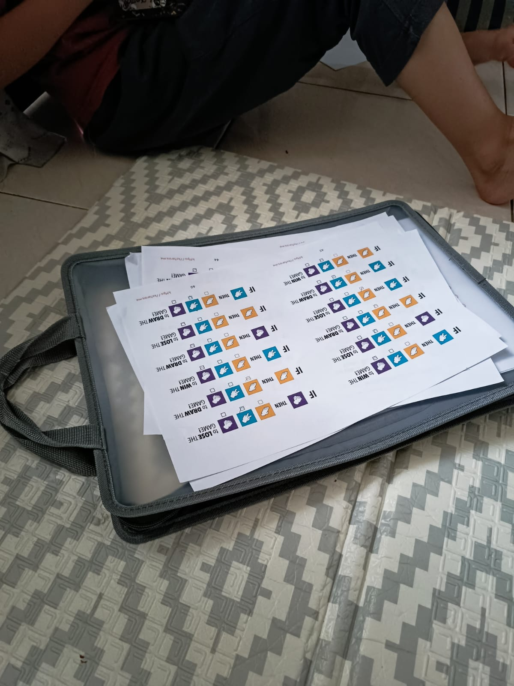

# 15 Juli 2025 - Log Kegiatan Harian
[Kembali](readme.md)

## 📌 Kegiatan
1. Numerasi:
   - Kegiatan: Mengerjakan worksheet "I am Engineer" Task 14
   - Alat/bahan: Worksheet "I am Engineer", Pensil
   - Durasi: 30 menit

## 🎯 Capaian Kegiatan
- Membaca dan mengerti rule algoritma dasar (if then else)

## 🚧 Kendala
- -

## 🖼️ Dokumentasi Kegiatan

[Kembali](readme.md)