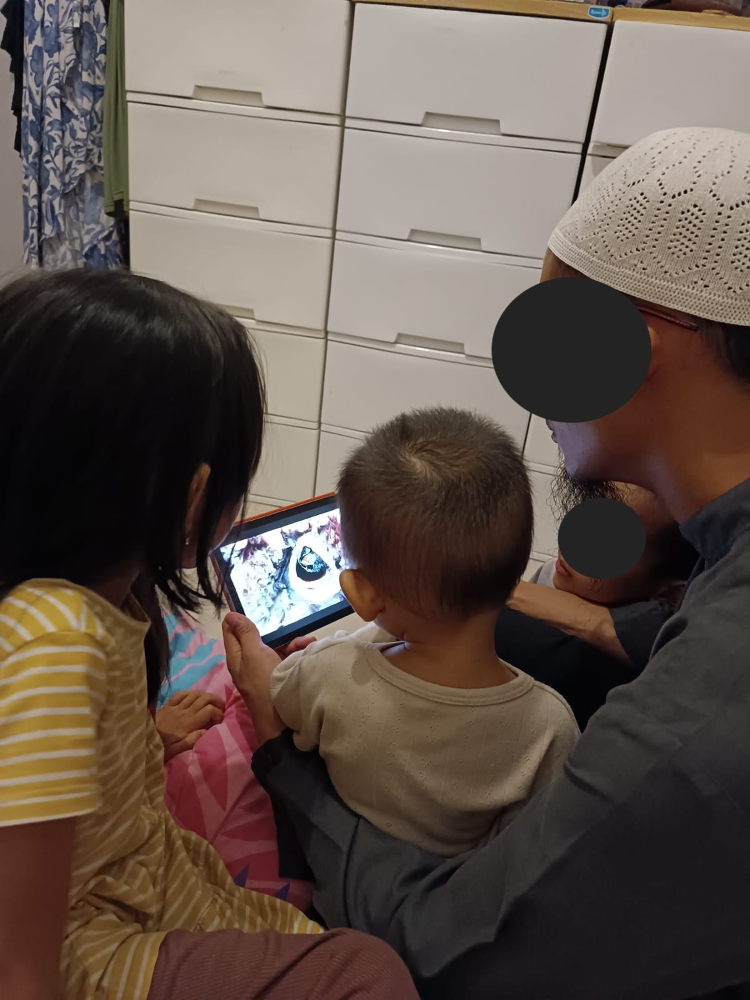

# 17 Juli 2025 - Log Kegiatan Harian
[Kembali](readme.md)

## 📌 Kegiatan
1. Sains:
   - Kegiatan: Belajar tentang nyamuk Aedes Aegypti
   - Alat/bahan: Tab, Youtube
   - Durasi: 30 menit

## 🎯 Capaian Kegiatan
- Memahami tentang nyamuk Aedes Aegypti.

## 🚧 Kendala
- -

## 🖼️ Dokumentasi Kegiatan

[Kembali](readme.md)