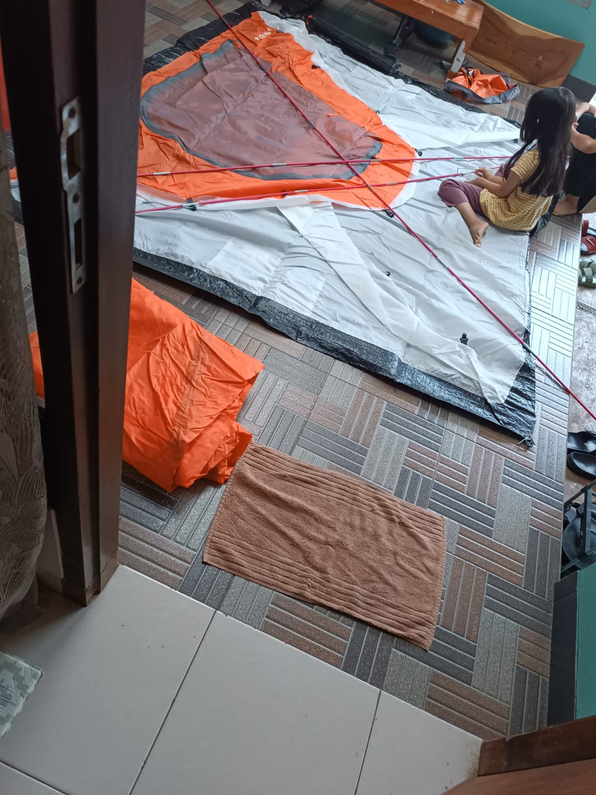

# 18 Juli 2025 - Log Kegiatan Harian
[Kembali](readme.md)

## 📌 Kegiatan
1. Persiapan Camping:
   - Kegiatan: Belajar merakit tenda
   - Alat/bahan: Tenda
   - Durasi: 30 menit

## 🎯 Capaian Kegiatan
- Memahami tata cara membangun tenda
- Meningkatkan keterampilan basic "survival life skill"

## 🚧 Kendala
- Aktifitas terkendala karena anak tetangga datang bermain kerumah, sehingga kegiatan berhenti sementara.

## 🖼️ Dokumentasi Kegiatan

[Kembali](readme.md)