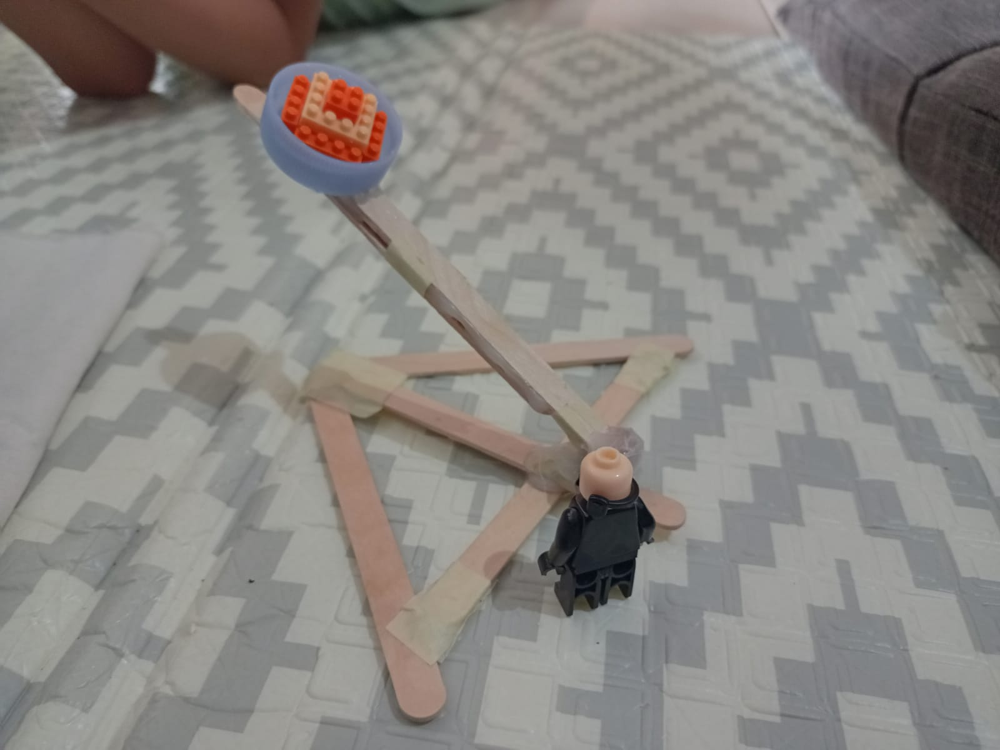

# 26 Juli 2025 - Log Kegiatan Harian
[Kembali](readme.md)

## 📌 Kegiatan
1. Handcrafting:
   - Kegiatan: Bikin catapult
   - Alat/bahan: stick es krim, tutup botol, binder clip, lem tembak.
   - Durasi: 60 menit

## 🎯 Capaian Kegiatan
- Menambah literasi mengenai konstruksi dan sejarah mengenai catapult.

## 🚧 Kendala
- 

## 🖼️ Dokumentasi Kegiatan

[Kembali](readme.md)