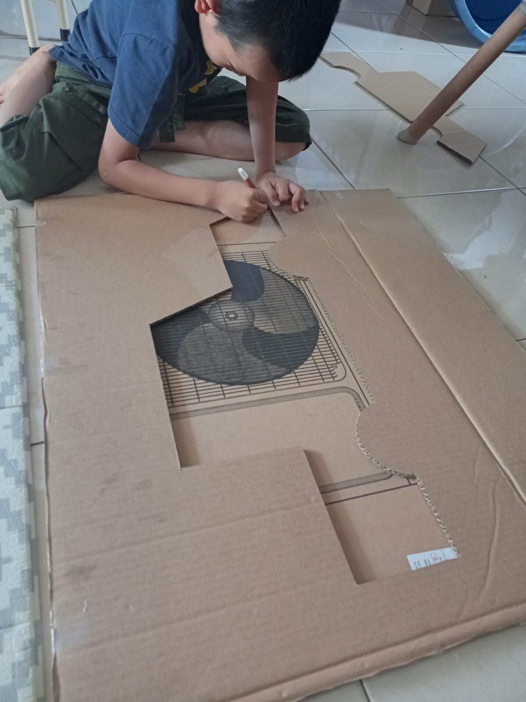
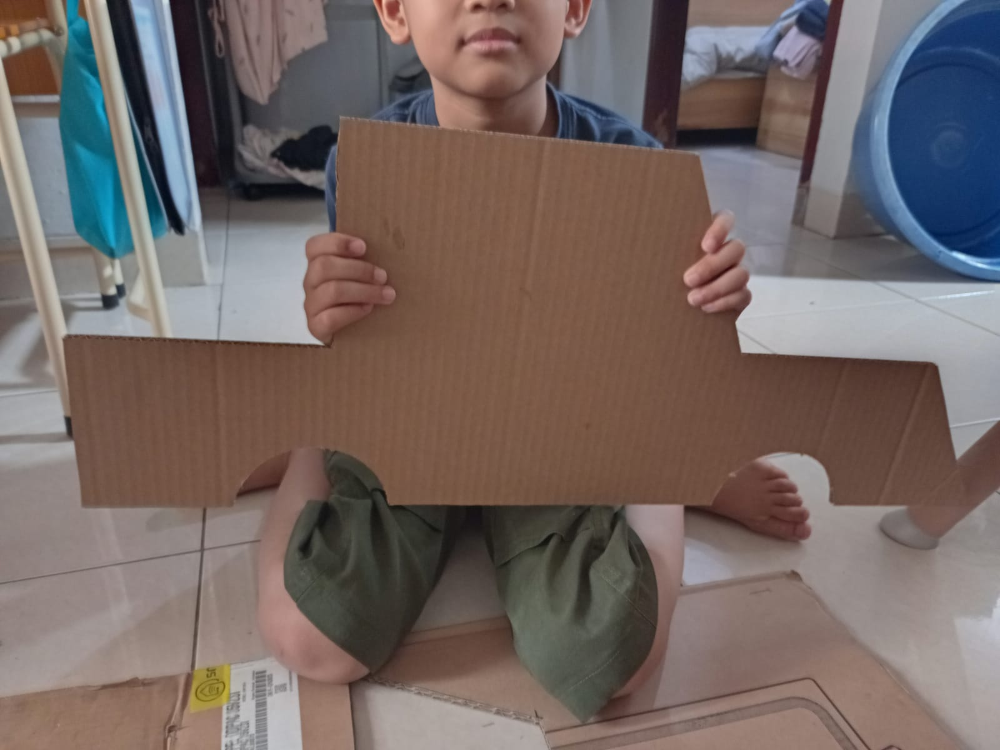

# 02 Agustus 2025 - Log Kegiatan Harian
[Kembali](readme.md)

## 📌 Kegiatan
1. Proyek Mobil Kardus:
   - Kegiatan: Mencetak desain mobil kardus pada potongan kardus.
   - Alat/bahan: Kardus, Cutter, Penggaris besi
   - Durasi: 60 menit

## 🎯 Capaian Kegiatan
- Bagian body mobil kardus sudah terbentuk.

## 🚧 Kendala
- Anak mengalami kesulitan ketika mencoba memotong kardus dikarenakan kardus yang digunakan terlalu tebal.

## 🖼️ Dokumentasi Kegiatan

[Kembali](readme.md)