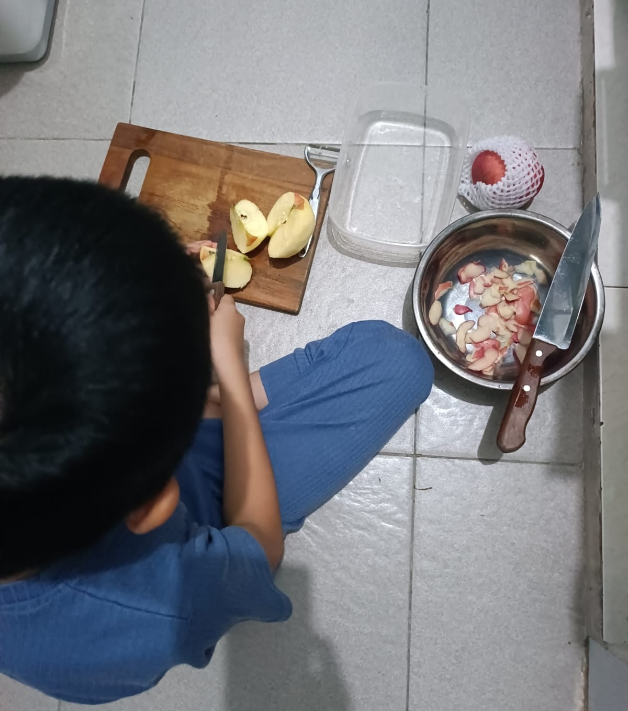
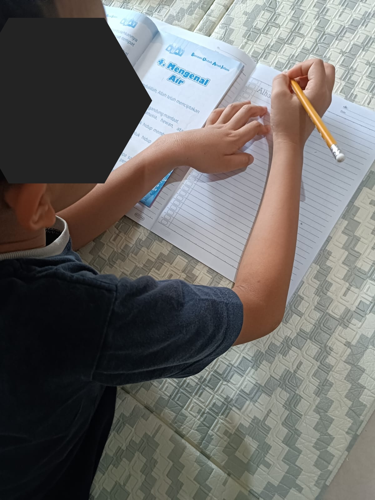

# 29 Juli 2025 - Log Kegiatan Harian
[Kembali](readme.md)

## 📌 Kegiatan
1. Memotong Buah:
   - Kegiatan: Menyiapkan buah potong
   - Alat/Bahan: Pisau, Buah apel.
   - Durasi: 60 menit

2. Belajar Fiqih Islam:
   - Kegiatan: Bab bersuci
   - Durasi: 60 menit

## 🎯 Capaian Kegiatan
- Buah Potong
- Mengenal jenis air untuk bersuci

## 🚧 Kendala
- 

## 🖼️ Dokumentasi Kegiatan

[Kembali](readme.md)