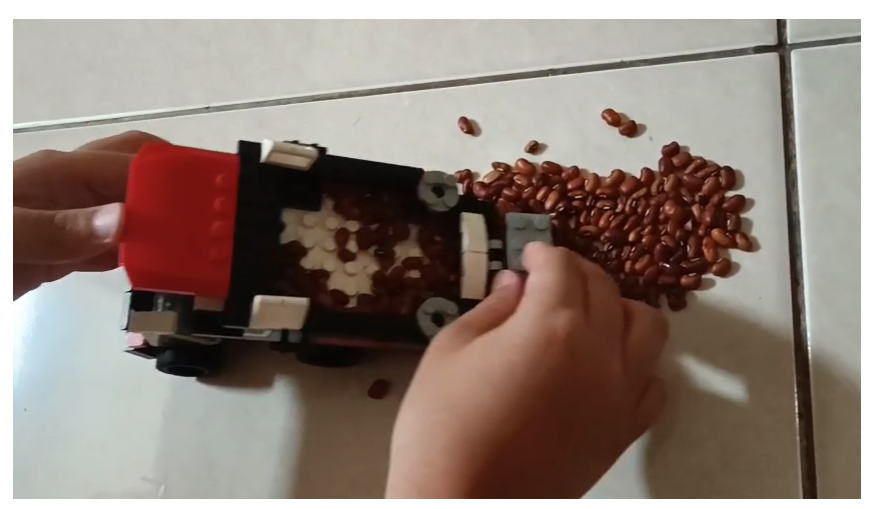

# 31 Juli 2025 - Log Kegiatan Harian
[Kembali](readme.md)

## 📌 Kegiatan
1. Handcrafting:
   - Kegiatan: Membuat Lego Truck
   - Alat/Bahan: Lego, Biji-bijian
   - Durasi: 60 menit

## 🎯 Capaian Kegiatan
- Membuat lego truck yang bisa bergerak (diangkat) baknya.

## 🚧 Kendala
- 

## 🖼️ Dokumentasi Kegiatan

[Kembali](readme.md)