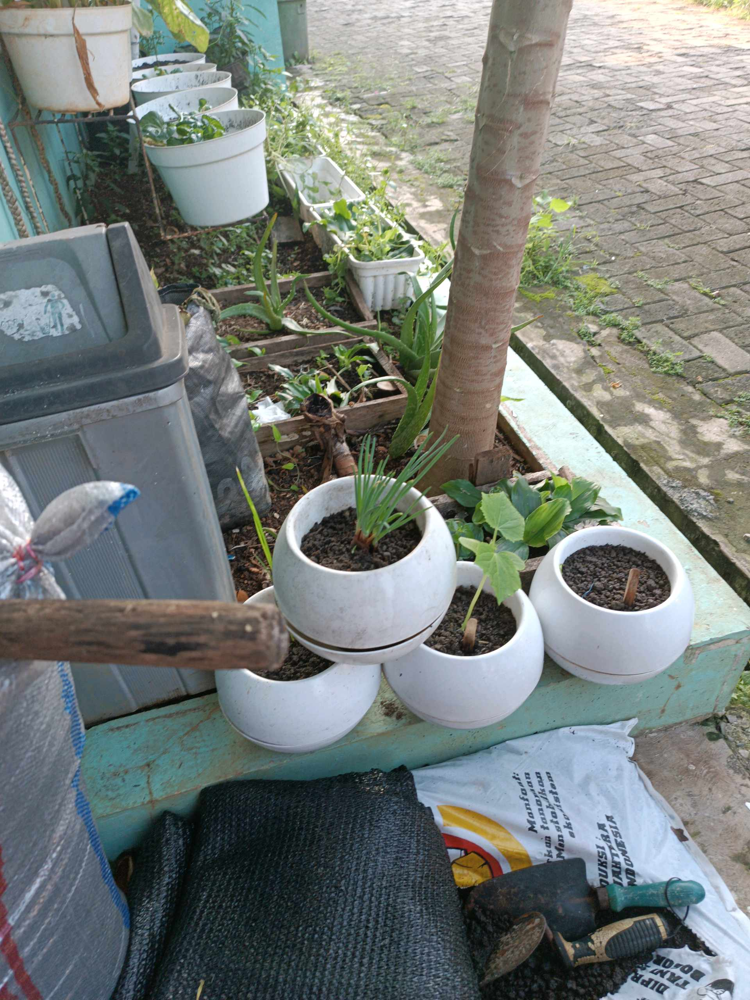

# 18 Agustus 2025 - Log Kegiatan Harian
[Kembali](readme.md)

## 📌 Kegiatan
1. Urban Farming
   - Kegiatan: Menyiram tanaman, menyiangi gulma, memindahkan tanaman ke pot yang lebih sesuai
   - Durasi: ±60 menit

## 🎯 Capaian Kegiatan
- Memahami kebutuhan dasar pertumbuhan tanaman

## 🚧 Kendala
- Tidak disebutkan

## 🖼️ Dokumentasi Kegiatan

[Kembali](readme.md)