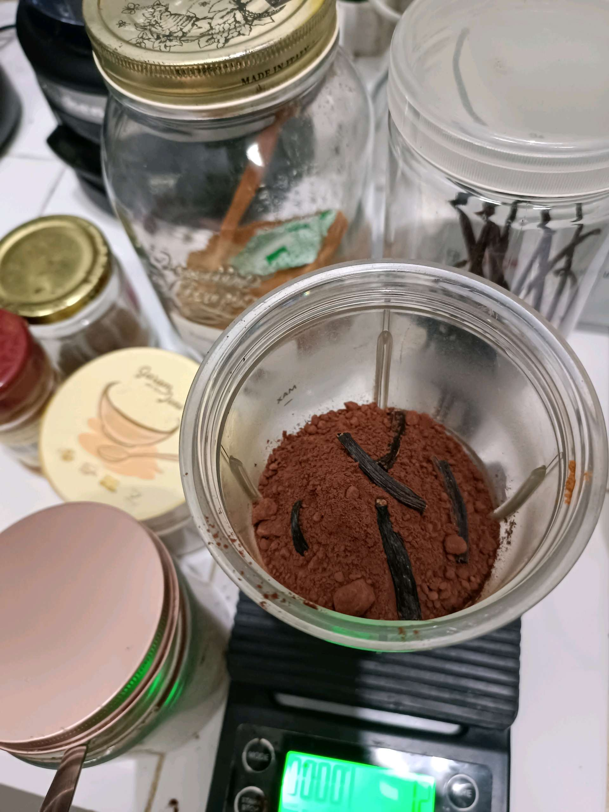

# 19 Agustus 2025 - Log Kegiatan Harian
[Kembali](readme.md)

## 📌 Kegiatan
1. Bahasa Inggris & Cooking
   - Kegiatan: SC bahasa Inggris; membuat premix cocoa powder dengan gula aren dan rempah
   - Durasi: ±60 menit

## 🎯 Capaian Kegiatan
- Menambah vocabulary
- Belajar komposisi minuman rempah

## 🚧 Kendala
- Tidak disebutkan

## 🖼️ Dokumentasi Kegiatan

[Kembali](readme.md)