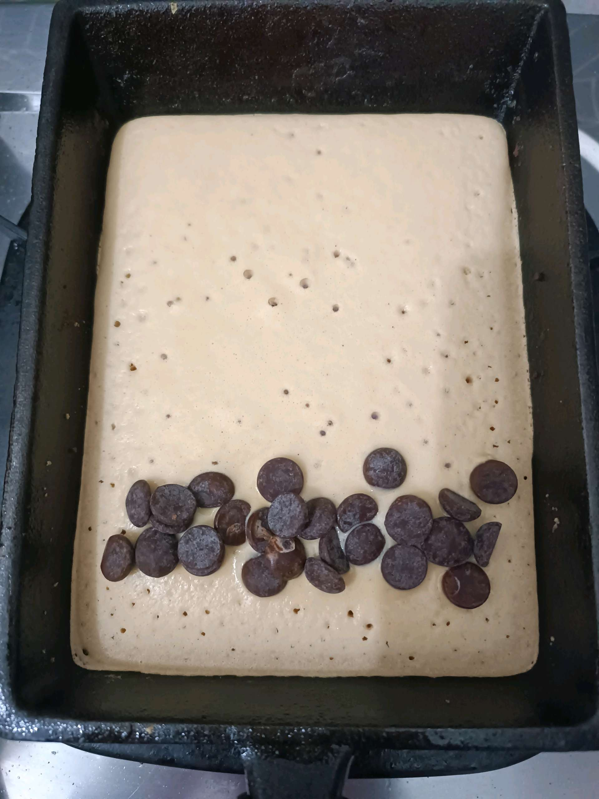
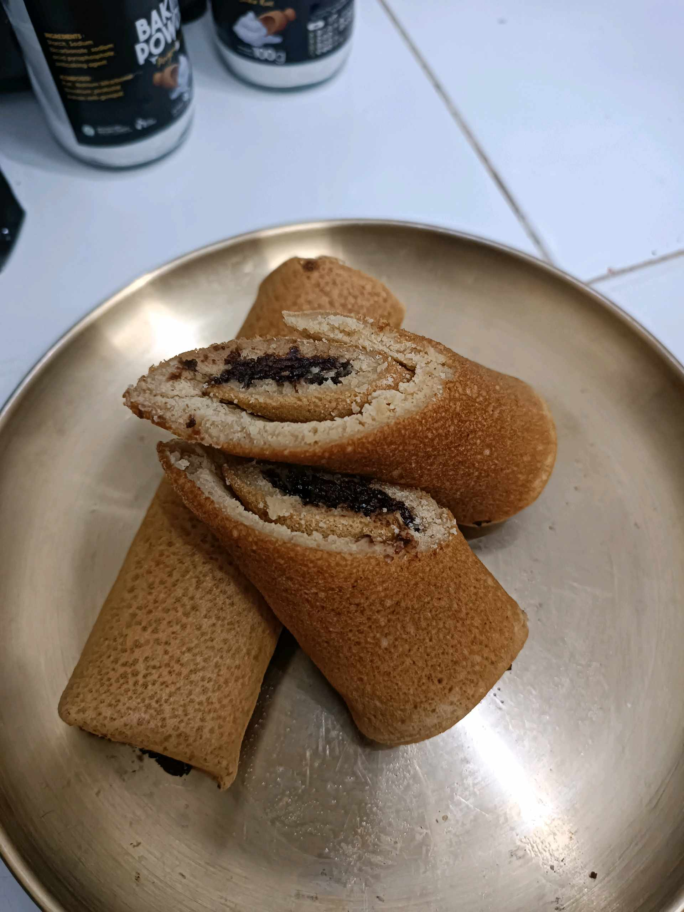

# 25 Agustus 2025 - Log Kegiatan Harian
[Kembali](readme.md)

## 📌 Kegiatan
1. Urban Farming & Cooking
   - Kegiatan: Merawat tanaman; membuat pancake roll isi coklat gluten-free
   - Alat/bahan: Tanaman, alat berkebun, bahan pancake
   - Durasi: ±90 menit

## 🎯 Capaian Kegiatan
- Melatih tanggung jawab merawat tanaman
- Memahami proses memasak sederhana
- Mengasah motorik halus

## 🚧 Kendala
- Tidak disebutkan

## 🖼️ Dokumentasi Kegiatan

[Kembali](readme.md)