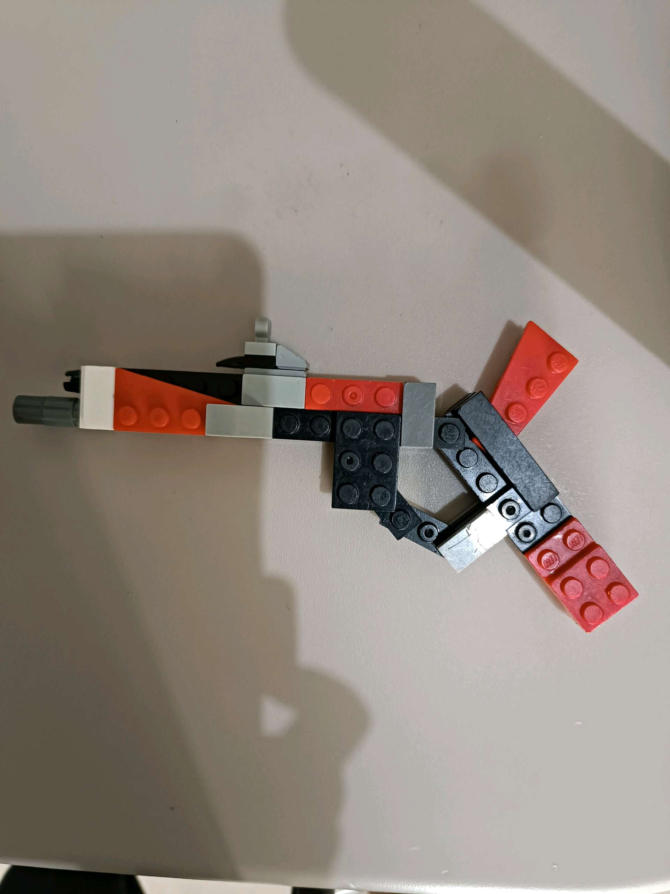

# 26 Agustus 2025 - Log Kegiatan Harian
[Kembali](readme.md)

## 📌 Kegiatan
1. Bahasa Inggris
   - Kegiatan: Membahas jenis senjata api dan membuat mainan senjata dari lego; membaca teks bahasa Inggris dan menjawab pertanyaan
   - Alat/bahan: Lego, teks bacaan Bahasa Inggris
   - Durasi: ±60–90 menit

## 🎯 Capaian Kegiatan
- Memahami kosakata baru terkait topik tertentu (weapons)
- Melatih reading comprehension
- Mengembangkan kreativitas merancang bentuk dari lego

## 🚧 Kendala
- Tidak disebutkan

## 🖼️ Dokumentasi Kegiatan

[Kembali](readme.md)