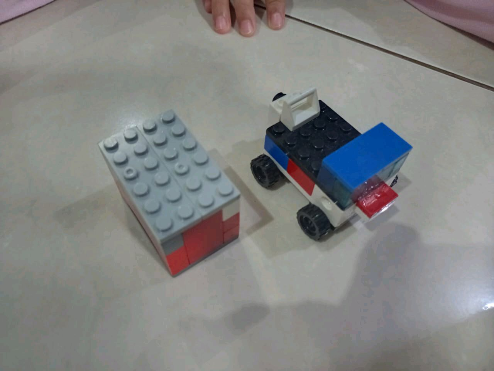

# 28 Agustus 2025 - Log Kegiatan Harian
[Kembali](readme.md)

## 📌 Kegiatan
1. Bahasa Jawa & Bahasa Arab
   - Kegiatan: Abang membuat mobil lego baru, lalu Kakak dan Abang mengikuti student club bahasa Jawa dan Arab
   - Alat/bahan: Lego, buku materi, laptop/zoom
   - Durasi: ±60 menit

## 🎯 Capaian Kegiatan
- Melatih kreativitas konstruksi dengan Lego
- Mempraktikkan percakapan sederhana bahasa Jawa
- Menghafal kosakata dasar bahasa Arab

## 🚧 Kendala
- Tidak disebutkan

## 🖼️ Dokumentasi Kegiatan

[Kembali](readme.md)