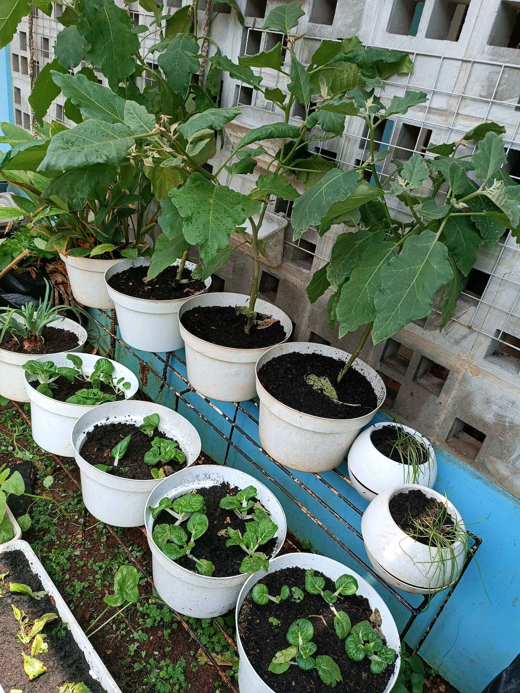

# 13 Oktober 2025 - Log Kegiatan Harian
[Kembali](readme.md)

## 📌 Kegiatan
1. Urban Farming & Cooking
   - Kegiatan: Mengikuti SC Urban Farming bersama Kak Andito dengan kegiatan menyiram tanaman, mendokumentasikan kondisi tanaman, dan melaporkan perkembangannya. Setelah itu membuat camilan bersama berupa quesadilla.
   - Alat/bahan: Tanaman, alat siram, kamera/HP, bahan masak
   - Durasi: ±120 menit

## 🎯 Capaian Kegiatan
- Menunjukkan tanggung jawab dalam merawat dan melaporkan kondisi tanaman.
- Melatih kemampuan observasi dan dokumentasi.
- Mengikuti proses memasak secara runtut.

## 🚧 Kendala
- Dokumentasi masih perlu dirapikan agar laporan lebih sistematis.

## 🖼️ Dokumentasi Kegiatan

[Kembali](readme.md)