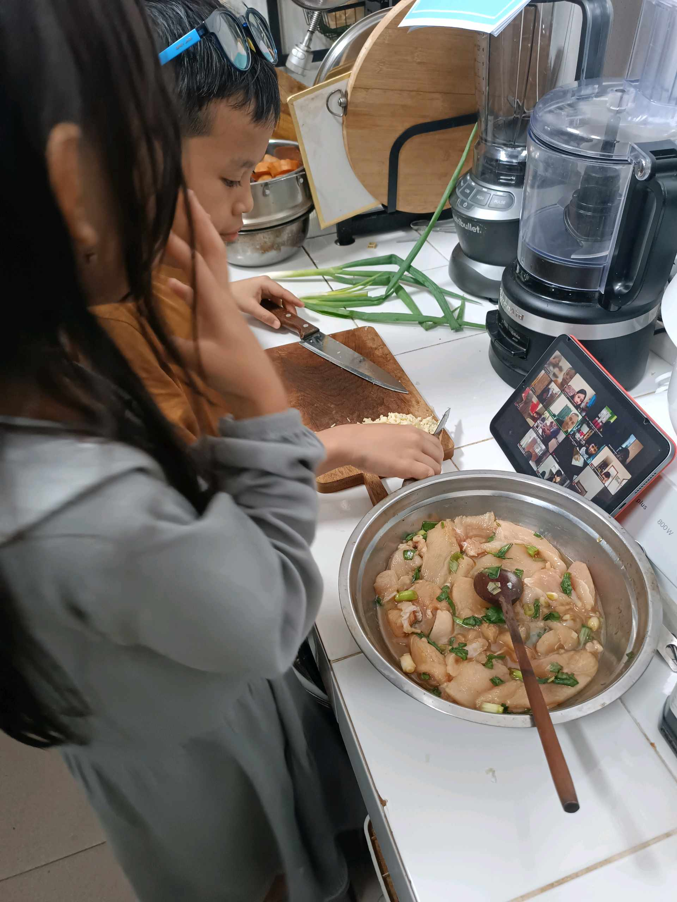

# 24 Oktober 2025 - Log Kegiatan Harian
[Kembali](readme.md)

## 📌 Kegiatan
1. Student Club Cooking Class
   - Kegiatan: Mengikuti cooking class yang dibimbing oleh Om Ery dengan menu chicken negi shio.
   - Alat/bahan: Bahan masak, peralatan dapur
   - Durasi: ±90 menit

## 🎯 Capaian Kegiatan
- Mengikuti tahapan memasak secara runtut.
- Mengenal teknik dasar memasak menu chicken negi shio.
- Melatih ketelitian dan kesabaran selama proses memasak.

## 🚧 Kendala
- Tetap memerlukan pendampingan saat menggunakan peralatan dapur.

## 🖼️ Dokumentasi Kegiatan

[Kembali](readme.md)