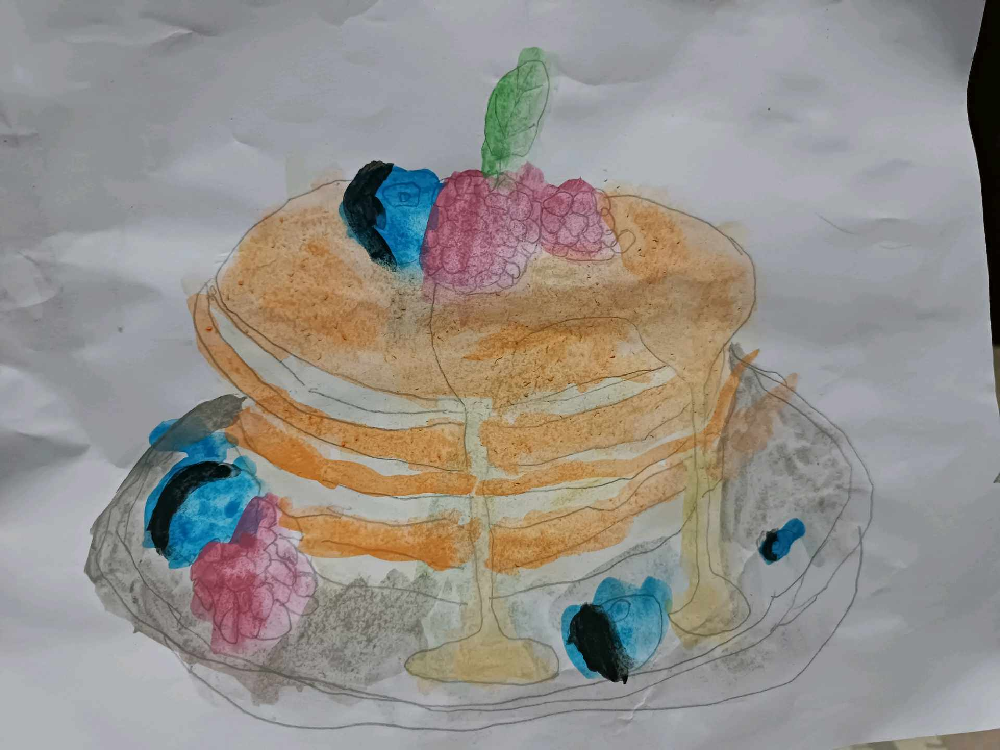

# 5 Desember 2025 - Log Kegiatan Harian

## 📌 Kegiatan
1. Cooking Class
   - Kegiatan: Mengikuti SC cooking class.
   - Alat/bahan: Bahan memasak
   - Durasi: ±60 menit

2. Melukis
   - Kegiatan: Mengikuti kegiatan melukis dengan cat air.
   - Alat/bahan: Cat air dan kertas gambar
   - Durasi: ±45 menit

## 🎯 Capaian Kegiatan
- Mengikuti kegiatan memasak sesuai arahan.
- Mengikuti kegiatan melukis dengan media cat air.

## 🚧 Kendala
- Tidak ada kendala yang dicatat.

## 🖼️ Dokumentasi Kegiatan

