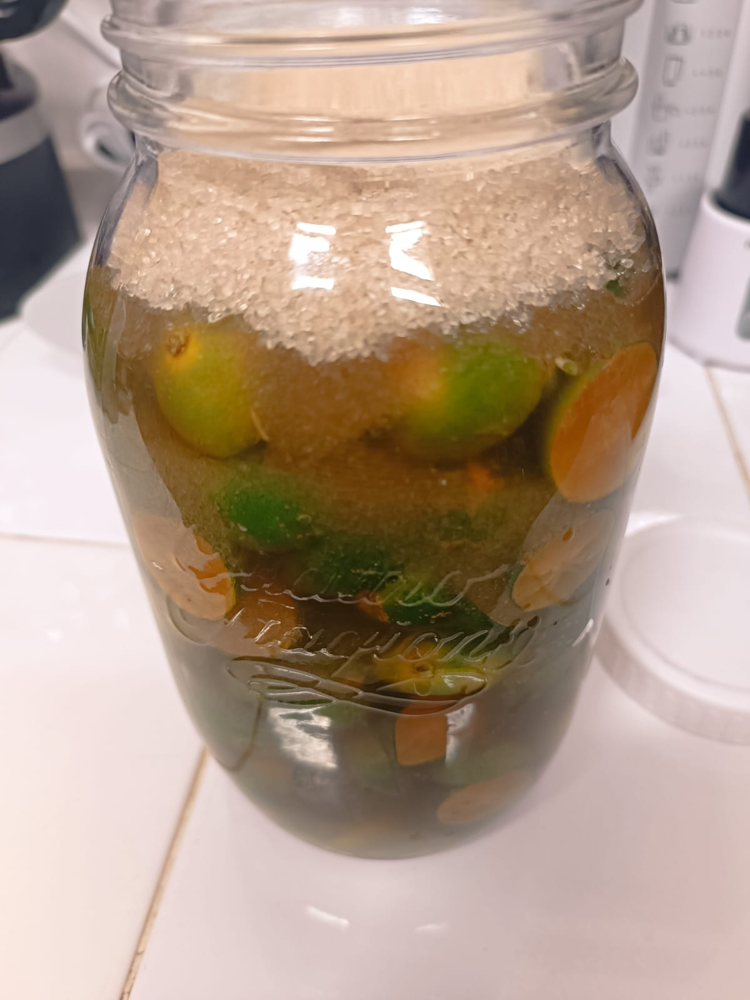

# 14 Juli 2025 - Log Kegiatan Harian
[Kembali](readme.md)

## 📌 Kegiatan
1. Sains:
   - Kegiatan: Membuat Sirup Jeruk Kasturi (Fermentasi)
   - Alat/bahan: Jeruk kasturi, gula pasir, air, toples, sendok,
   - Durasi: 30 menit

## 🎯 Capaian Kegiatan
- Memahami tata cara membuat fermentasi buah.

## 🚧 Kendala
- -

## 🖼️ Dokumentasi Kegiatan

[Kembali](readme.md)