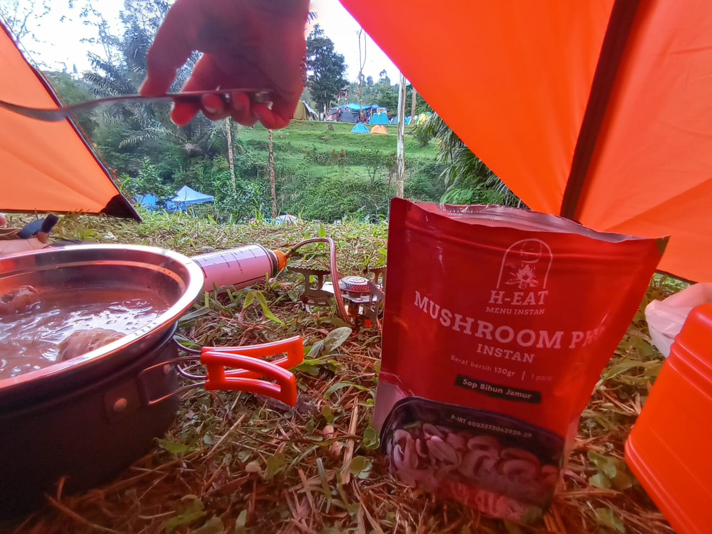

# 20 Juli 2025 - Log Kegiatan Harian
[Kembali](readme.md)

## 📌 Kegiatan
1. Fisika:
   - Kegiatan: Belajar hukum archimedes
   - Alat/bahan: Batu kali dan aliran air sungai
   - Durasi: 30 menit

2. Konstruksi:
   - Kegiatan: Membangun bendungan dari batu kali
   - Alat/bahan: Batu kali dan aliran air sungai
   - Durasi: 45 menit

3. Biologi:
   - Kegiatan: Menemukan jenis-jenis tanaman di sekitar sungai
   - Durasi: 15 menit

## 🎯 Capaian Kegiatan
- Memahami konsep dasar bendungan
- Memahami konsep dasar hukum archimedes bouyancy (gaya apung keatas)
- Mengetahui jenis-jenis tanaman di sekitar sungai -- salah satunya adalah bunga terompet

## 🚧 Kendala
- Anak sempat terpeleset dan terjatuh saat membangun bendungan.

## 🖼️ Dokumentasi Kegiatan

[Kembali](readme.md)