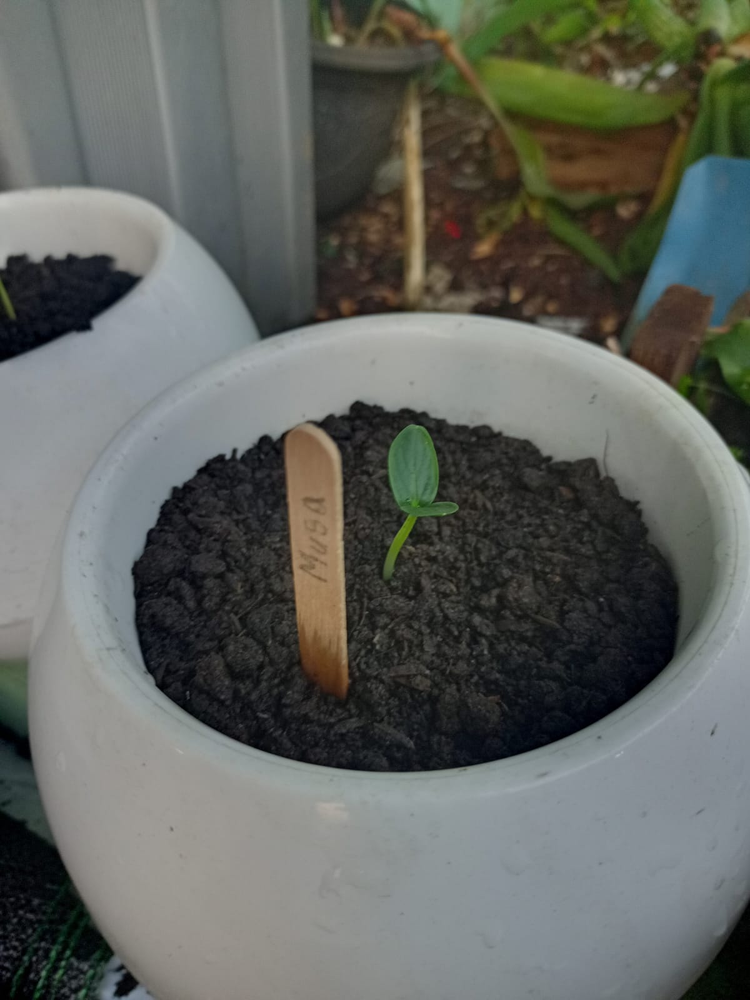

# 06 Agustus 2025 - Log Kegiatan Harian
[Kembali](readme.md)

## 📌 Kegiatan
1. Numerasi:
   - Kegiatan: Melanjutkan mengerjakan worksheet "I am Engineer" Task 18 (Practicing Loops)
   - Alat/bahan: Worksheet "I am Engineer", Pensil
   - Durasi: 30 menit

2. Literasi:
   - Kegiatan: Memabaca AISAR Jilid 2
   - Alat/bahan: Buku AISAR Lish Shighar Jilid 2
   - Durasi: 30 menit

3. Biologi:
   - Kegiatan: Mengamati tanaman terong
   - Durasi: 30 menit

## 🎯 Capaian Kegiatan
- Task 18 selesai
- Tanaman terong sudah mulai tumbuh (sprout)

## 🚧 Kendala
- 

## 🖼️ Dokumentasi Kegiatan

[Kembali](readme.md)