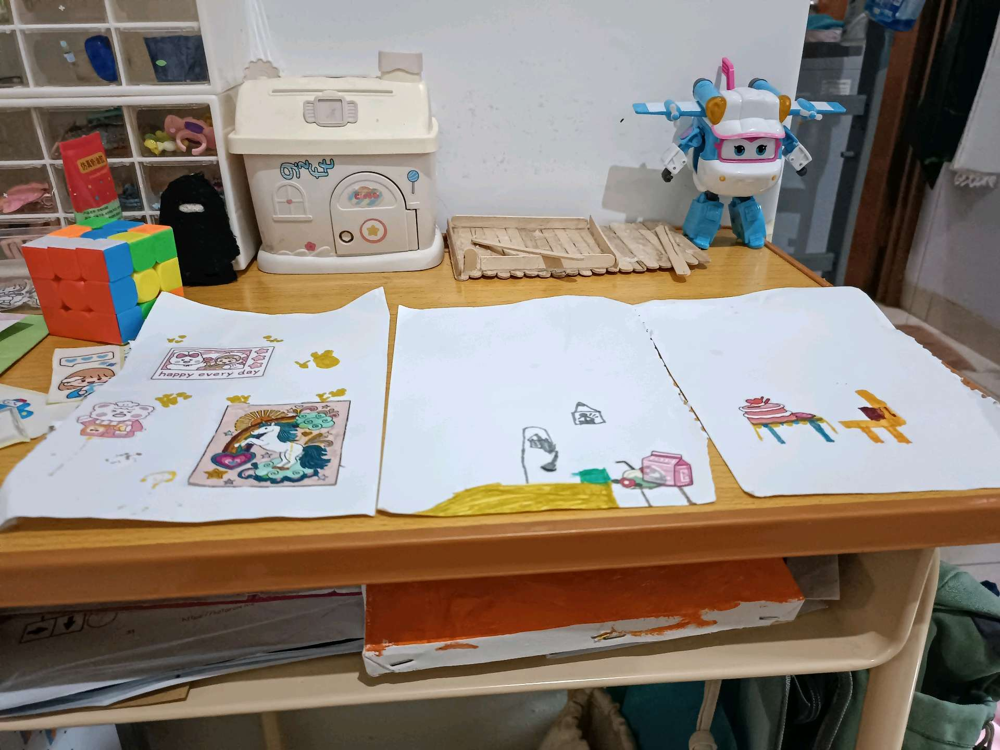
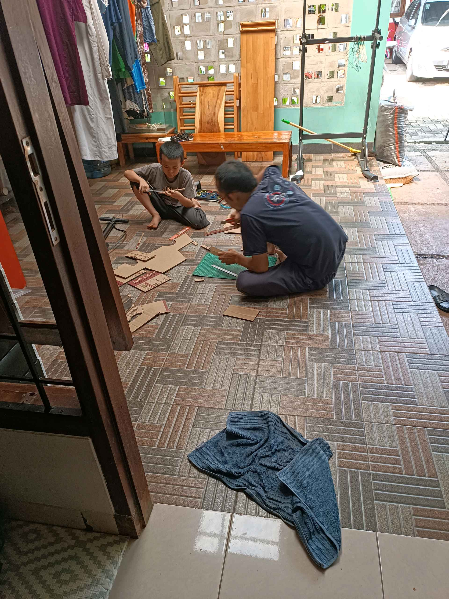
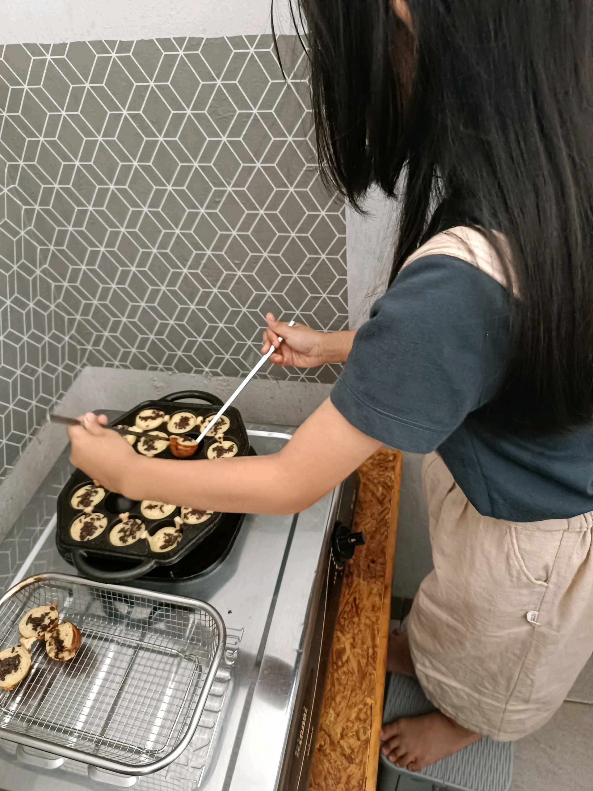
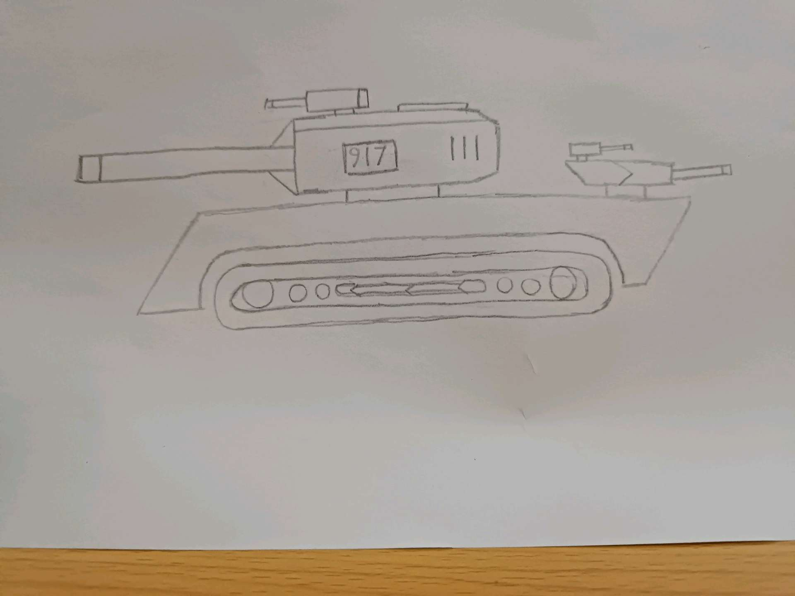

# 9 Agustus 2025 - Log Kegiatan Harian
[Kembali](readme.md)

## 📌 Kegiatan
1. Crafting, Art, Cooking
   - Kegiatan: Menggambar perabotan; membuat mobil jeep dari kardus; membuat kue cubit; menggambar tank; membuat smoothie
   - Durasi: ±90–120 menit

## 🎯 Capaian Kegiatan
- Melatih kreativitas crafting
- Motorik halus dalam memasak & menggambar
- Menyelesaikan proyek jangka pendek (mobil kardus)

## 🚧 Kendala
- Tidak disebutkan

## 🖼️ Dokumentasi Kegiatan

[Kembali](readme.md)