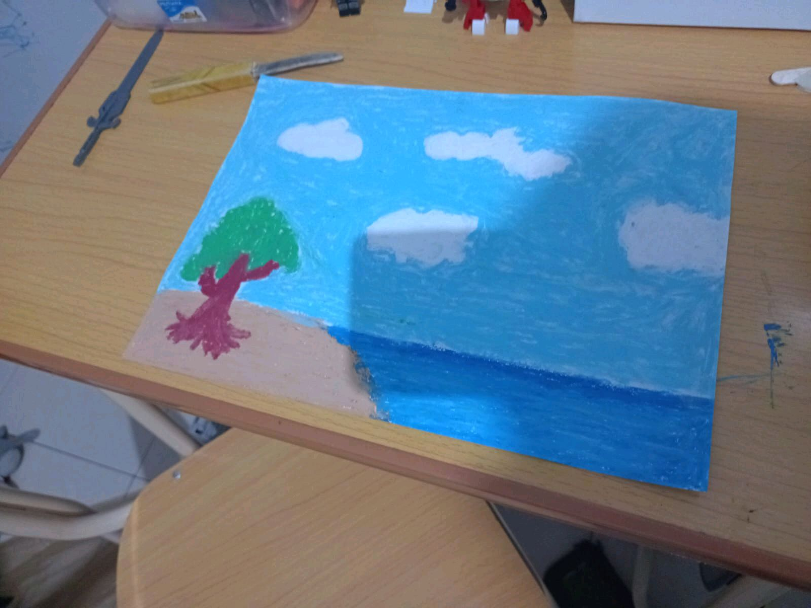

# 12 Agustus 2025 - Log Kegiatan Harian
[Kembali](readme.md)

## 📌 Kegiatan
1. Bahasa Inggris & Art
   - Kegiatan: Abang membaca buku berbahasa Inggris; kakak dibacakan buku; melukis pemandangan laut
   - Durasi: ±90 menit

## 🎯 Capaian Kegiatan
- Melatih kemampuan membaca dalam bahasa Inggris
- Ekspresi artistik melalui lukisan

## 🚧 Kendala
- Tidak disebutkan

## 🖼️ Dokumentasi Kegiatan

[Kembali](readme.md)