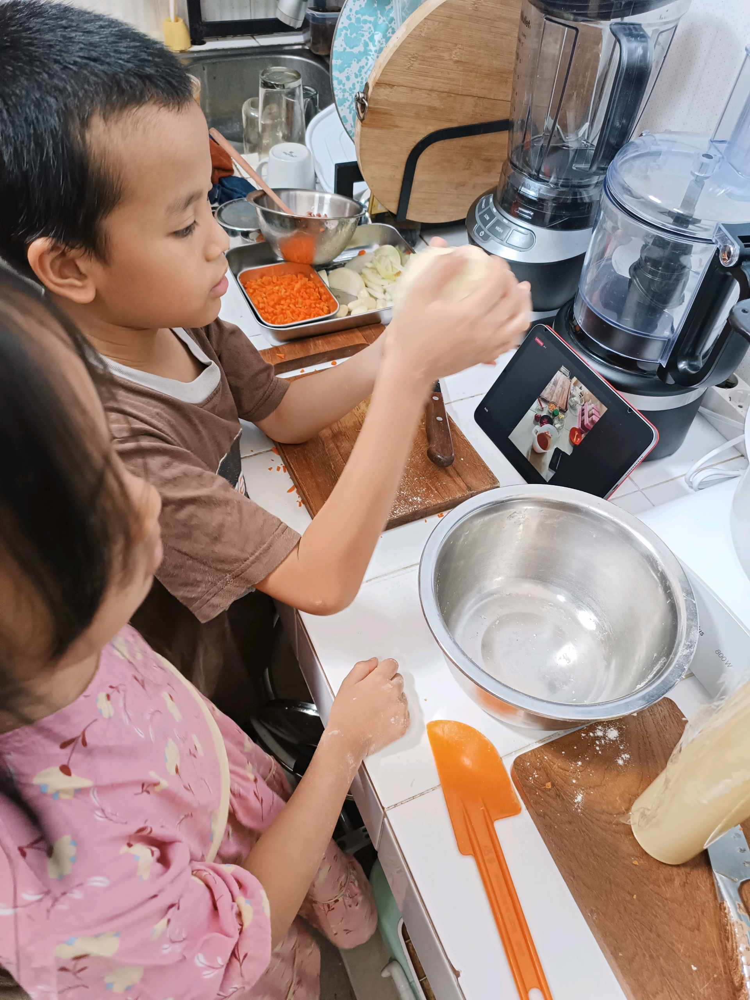

# 15 Agustus 2025 - Log Kegiatan Harian
[Kembali](readme.md)

## 📌 Kegiatan
1. Cooking & Art
   - Kegiatan: Membuat pastel bolognese; melukis dengan cat air
   - Durasi: ±90 menit

## 🎯 Capaian Kegiatan
- Belajar teknik memasak pastel
- Belajar teknik dasar cat air

## 🚧 Kendala
- Tidak disebutkan

## 🖼️ Dokumentasi Kegiatan

[Kembali](readme.md)