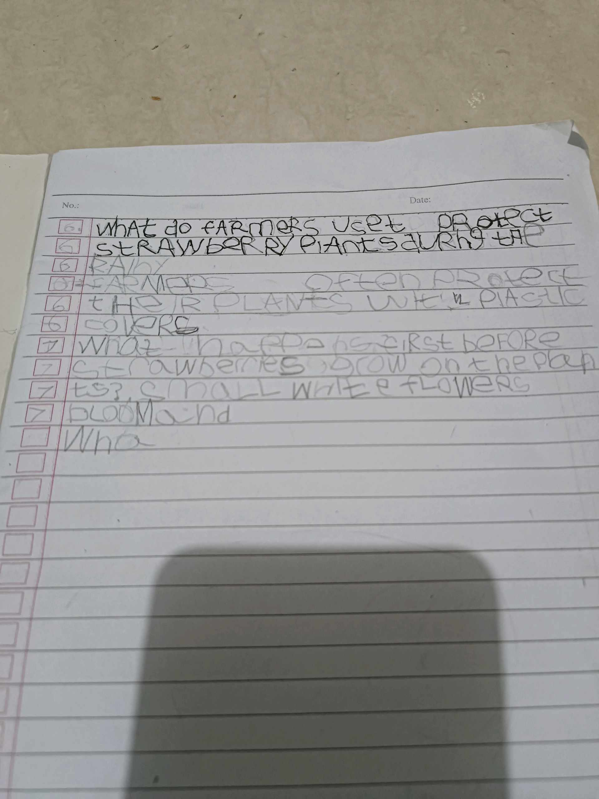
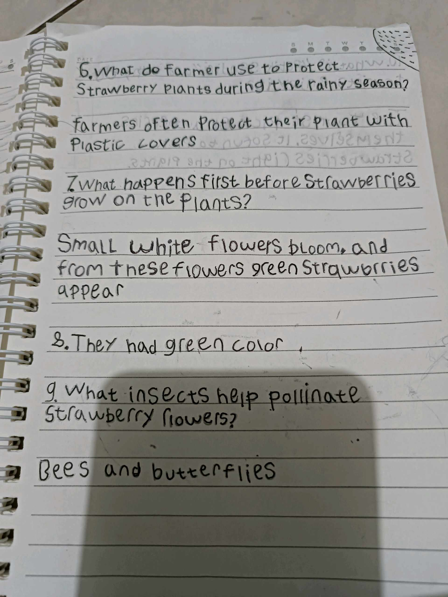

# 1 September 2025 - Log Kegiatan Harian
[Kembali](readme.md)

## 📌 Kegiatan
1. Urban Farming
   - Kegiatan: Mengikuti kegiatan urban farming dengan menyiram dan merawat tanaman.
   - Alat/bahan: Alat siram, tanaman
   - Durasi: ±60 menit

2. Tugas Bahasa Inggris
   - Kegiatan: Mengerjakan tugas Bahasa Inggris.
   - Alat/bahan: Buku tugas, alat tulis
   - Durasi: ±45 menit

## 🎯 Capaian Kegiatan
- Menunjukkan tanggung jawab dalam merawat tanaman.
- Menyelesaikan tugas Bahasa Inggris sesuai arahan.
- Melatih kemandirian belajar.

## 🚧 Kendala
- Perlu diingatkan untuk menjaga konsistensi saat menyiram tanaman.

## 🖼️ Dokumentasi Kegiatan

[Kembali](readme.md)