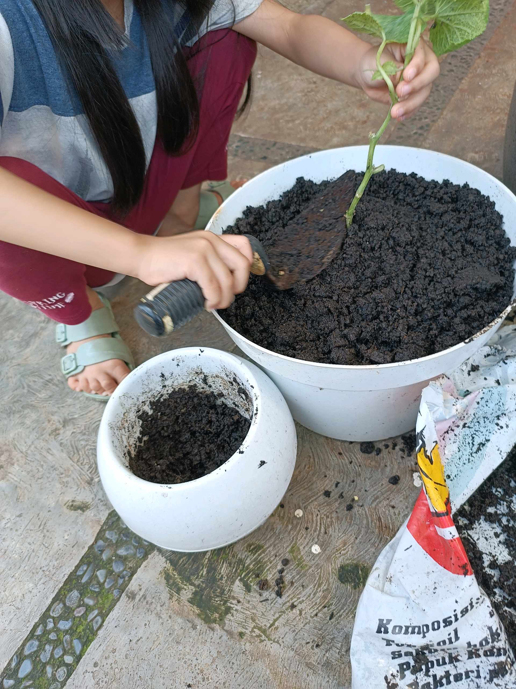
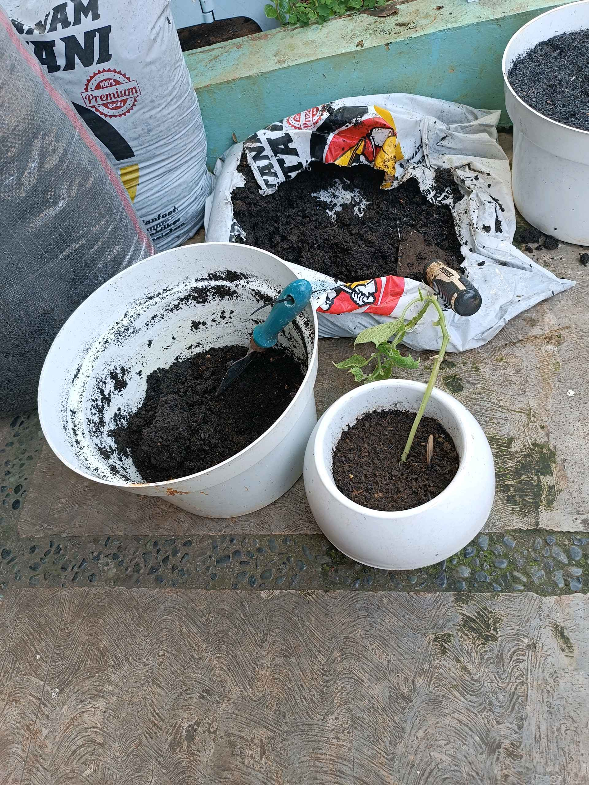
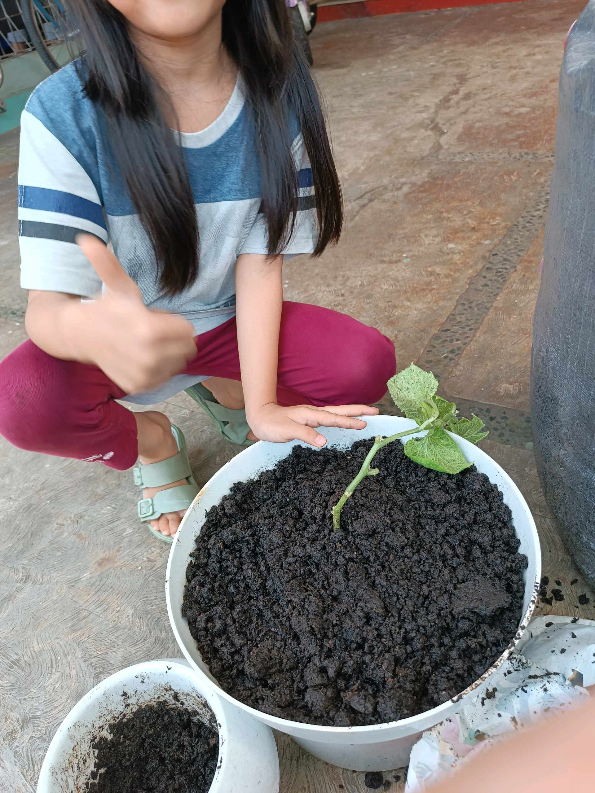

# 8 September 2025 - Log Kegiatan Harian
[Kembali](readme.md)

## 📌 Kegiatan
1. Urban Farming
   - Kegiatan: Menyiram tanaman, menyiangi gulma, dan memindahkan beberapa tanaman sayuran ke media tanam yang lebih sesuai.
   - Alat/bahan: Alat siram, tanaman, media tanam
   - Durasi: ±90 menit

## 🎯 Capaian Kegiatan
- Menunjukkan kepedulian terhadap tanaman.
- Mengenal proses perawatan dan pemindahan tanaman.
- Melatih ketelitian dan tanggung jawab.

## 🚧 Kendala
- Perlu diingatkan agar berhati-hati saat memindahkan tanaman.

## 🖼️ Dokumentasi Kegiatan

[Kembali](readme.md)