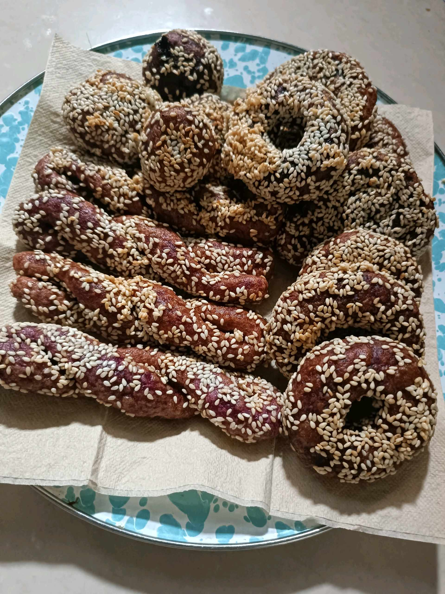

# 12 September 2025 - Log Kegiatan Harian
[Kembali](readme.md)

## 📌 Kegiatan
1. Cooking Activity
   - Kegiatan: Musa belajar membuat donat dari ubi ungu bersama keluarga. Musa terlibat dalam proses menyiapkan bahan, mengolah adonan, dan membentuk donat.
   - Alat/bahan: Ubi ungu, bahan adonan donat
   - Durasi: ±90 menit

## 🎯 Capaian Kegiatan
- Mengenal proses pengolahan bahan makanan dari ubi ungu.
- Melatih motorik halus dan koordinasi tangan.
- Mengikuti tahapan memasak secara runtut.

## 🚧 Kendala
- Tetap memerlukan pendampingan saat proses memasak.

## 🖼️ Dokumentasi Kegiatan

[Kembali](readme.md)