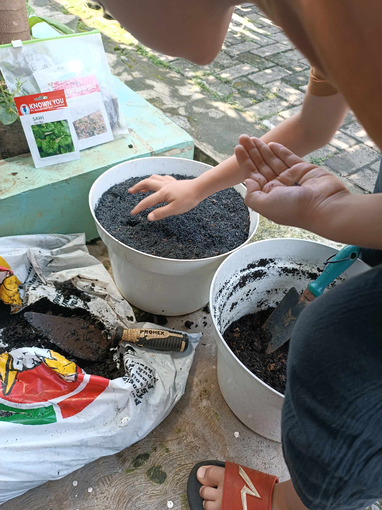
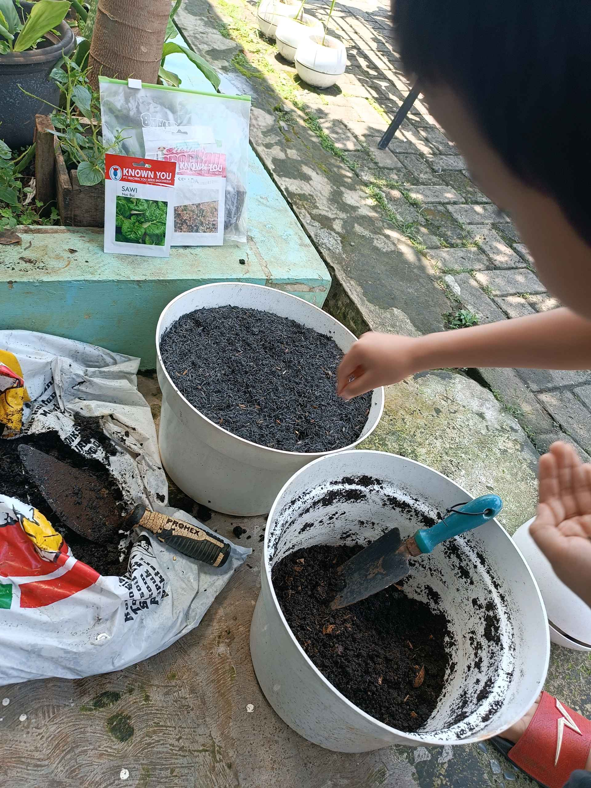

# 15 September 2025 - Log Kegiatan Harian
[Kembali](readme.md)

## 📌 Kegiatan
1. Urban Farming
   - Kegiatan: Melakukan kegiatan urban farming dengan menanam ulang sayuran yang rusak serta merawat tanaman lainnya.
   - Alat/bahan: Tanaman, media tanam, alat berkebun
   - Durasi: ±90 menit

## 🎯 Capaian Kegiatan
- Mengenal pentingnya merawat tanaman yang mengalami kerusakan.
- Melatih tanggung jawab dan kepedulian terhadap lingkungan.
- Mengembangkan ketelitian saat menanam ulang tanaman.

## 🚧 Kendala
- Perlu diingatkan untuk berhati-hati agar tidak merusak tanaman lain saat proses menanam ulang.

## 🖼️ Dokumentasi Kegiatan

[Kembali](readme.md)