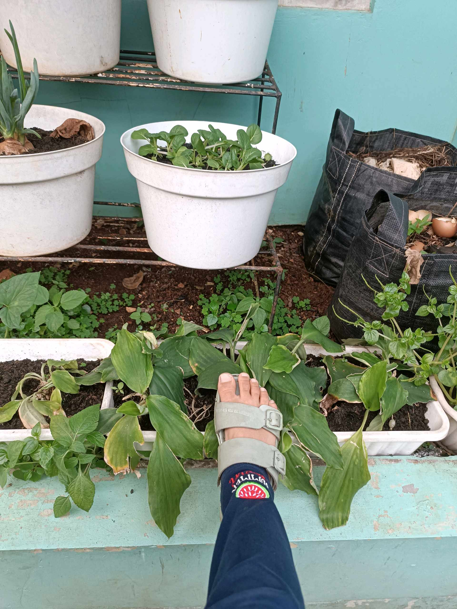

# 12 Oktober 2025 - Log Kegiatan Harian
[Kembali](readme.md)

## 📌 Kegiatan
1. Urban Farming
   - Kegiatan: Musa merawat tanaman dengan menyiram dan menyiangi gulma secara mandiri.
   - Alat/bahan: Alat siram, alat kebun
   - Durasi: ±60 menit

## 🎯 Capaian Kegiatan
- Menunjukkan kemandirian dalam merawat tanaman.
- Memahami pentingnya kebersihan media tanam.
- Melatih konsistensi kegiatan berkebun di hari libur.

## 🚧 Kendala
- Tidak ada kendala signifikan.

## 🖼️ Dokumentasi Kegiatan

[Kembali](readme.md)