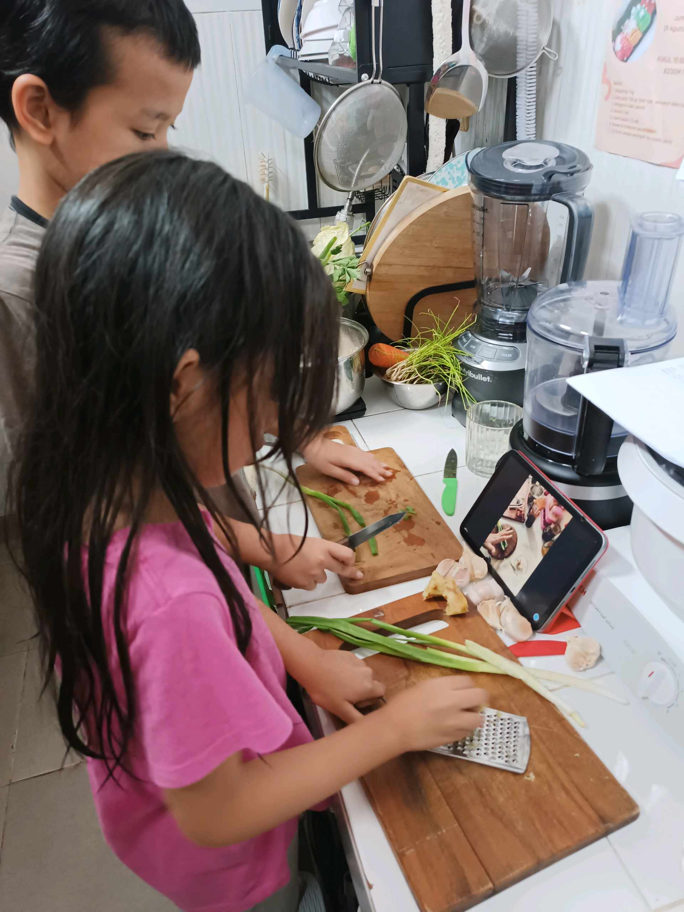
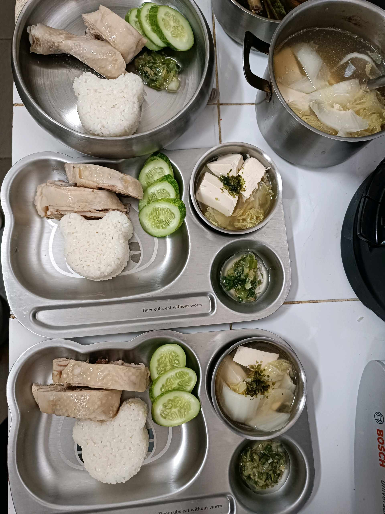

# 17 Oktober 2025 - Log Kegiatan Harian
[Kembali](readme.md)

## 📌 Kegiatan
1. Cooking Class & Melukis
   - Kegiatan: Mengikuti SC cooking class membuat nasi ayam Hainan, kemudian mengikuti SC melukis.
   - Alat/bahan: Bahan masak, alat dapur, cat air, kuas
   - Durasi: ±2 jam

## 🎯 Capaian Kegiatan
- Memahami tahapan memasak nasi ayam Hainan.
- Melatih ketelitian dan kesabaran saat memasak.
- Mengekspresikan kreativitas melalui kegiatan melukis.

## 🚧 Kendala
- Membutuhkan pendampingan saat menggunakan alat panas.

## 🖼️ Dokumentasi Kegiatan

[Kembali](readme.md)