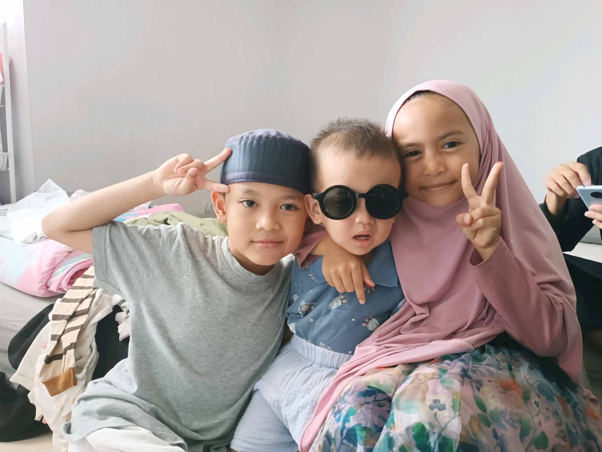

# 25 Oktober 2025 - Log Kegiatan Harian
[Kembali](readme.md)

## 📌 Kegiatan
1. Aktivitas Keluarga
   - Kegiatan: Menemani baba mencari pakaian kerja ke kantor. Abang dan kakak membantu menjaga adik sementara umma menyiapkan perlengkapan.
   - Alat/bahan: -
   - Durasi: ±120 menit

## 🎯 Capaian Kegiatan
- Menunjukkan tanggung jawab dalam membantu keluarga.
- Belajar menjaga adik dengan pendampingan.
- Mengembangkan sikap peduli dan kerja sama dalam keluarga.

## 🚧 Kendala
- Kadang merasa lelah dan perlu diingatkan untuk beristirahat.

## 🖼️ Dokumentasi Kegiatan

[Kembali](readme.md)