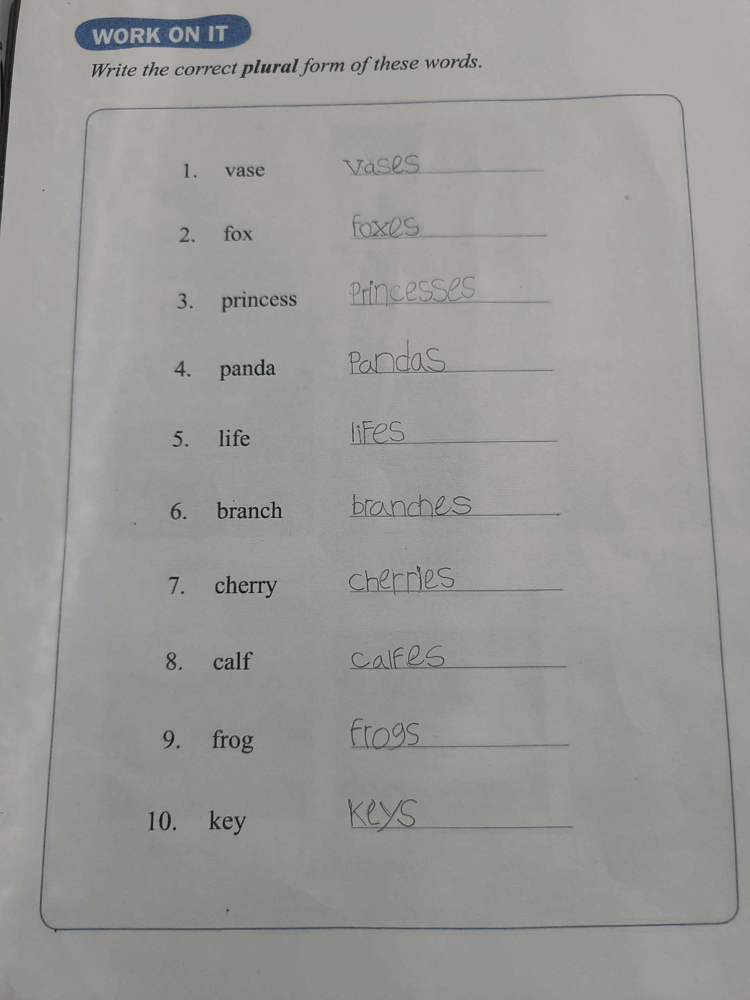

# 28 Oktober 2025 - Log Kegiatan Harian
[Kembali](readme.md)

## 📌 Kegiatan
1. Tugas Bahasa Inggris
   - Kegiatan: Mengerjakan tugas Bahasa Inggris yang diberikan oleh Miss Anita.
   - Alat/bahan: Buku tugas, alat tulis
   - Durasi: ±60 menit

## 🎯 Capaian Kegiatan
- Menyelesaikan tugas Bahasa Inggris sesuai arahan.
- Melatih kemampuan membaca dan memahami instruksi.
- Meningkatkan kemandirian belajar.

## 🚧 Kendala
- Beberapa soal memerlukan waktu lebih lama untuk dipahami.

## 🖼️ Dokumentasi Kegiatan

[Kembali](readme.md)