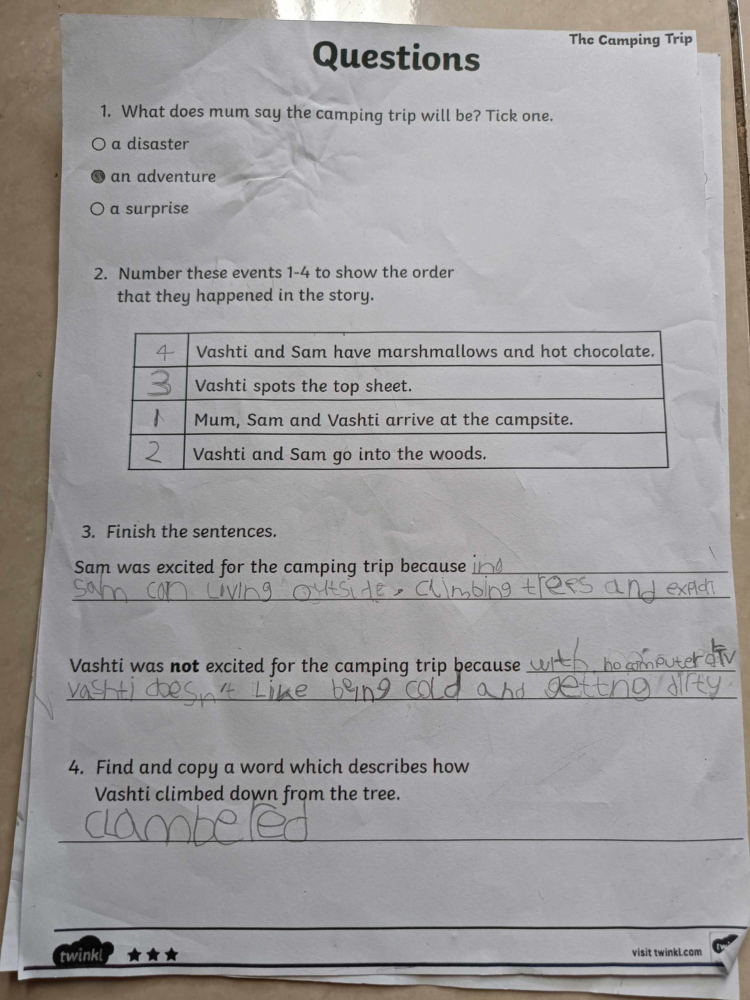
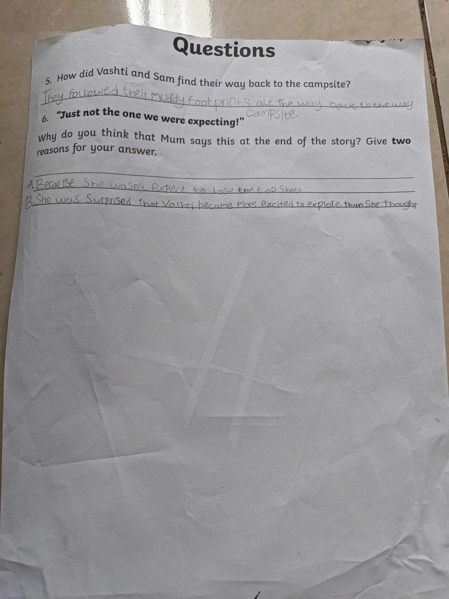
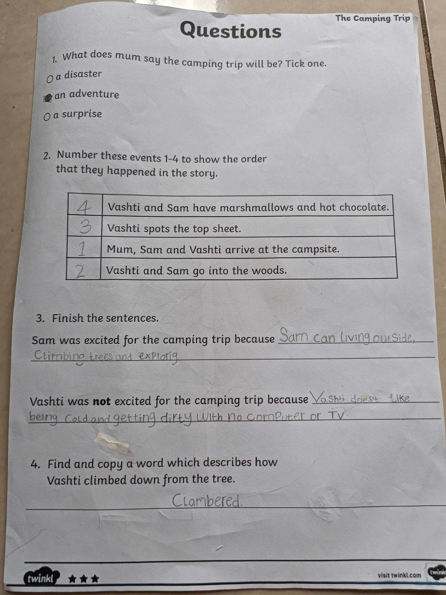
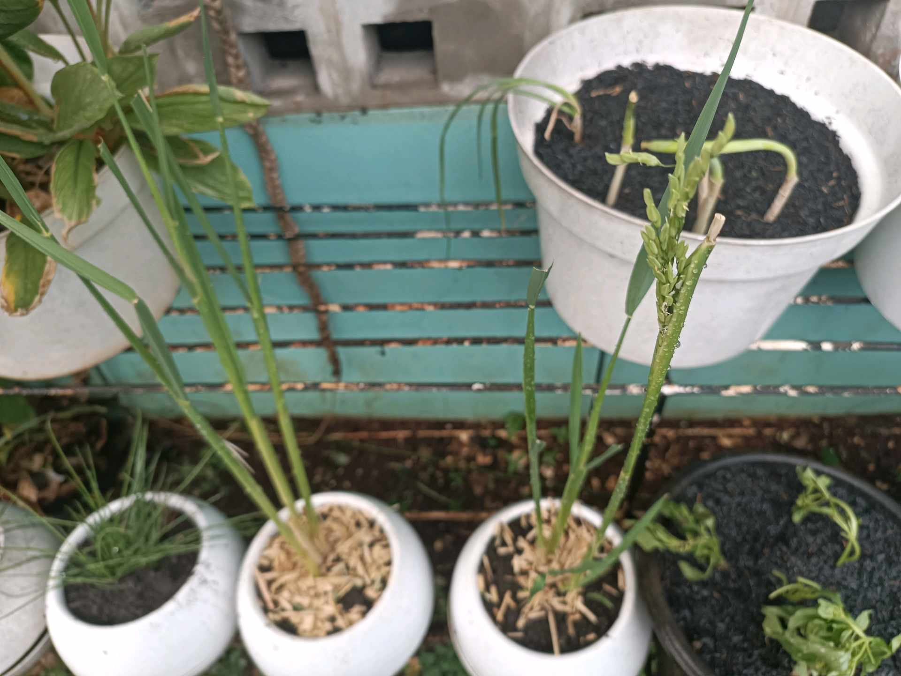

# 1 Desember 2025 - Log Kegiatan Harian

## 📌 Kegiatan
1. Urban Farming
   - Kegiatan: Mengikuti SC urban farming dengan memanen sayur sawi yang sudah siap panen. Hasil panen kemudian dimasak bersama.
   - Alat/bahan: Peralatan berkebun, sayur sawi
   - Durasi: ±90 menit

2. Bahasa Inggris
   - Kegiatan: Mengerjakan tugas Bahasa Inggris.
   - Alat/bahan: Buku tugas, alat tulis
   - Durasi: ±45 menit

## 🎯 Capaian Kegiatan
- Mengikuti proses panen hingga pengolahan hasil kebun.
- Menyelesaikan tugas Bahasa Inggris yang diberikan.

## 🚧 Kendala
- Tidak ada kendala yang dicatat.

## 🖼️ Dokumentasi Kegiatan

