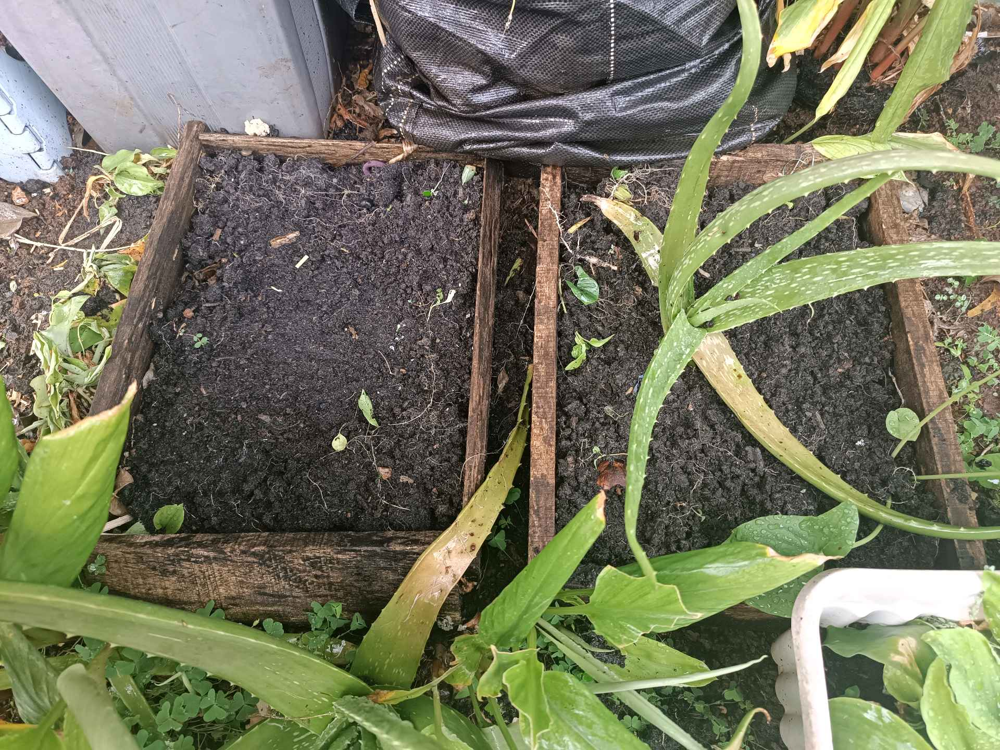

# 8 Desember 2025 - Log Kegiatan Harian

## 📌 Kegiatan
1. Perawatan Tanaman
   - Kegiatan: Merawat tanaman dengan menyiram dan menyiangi gulma di area kebun rumah.
   - Alat/bahan: Air, alat kebun sederhana
   - Durasi: ±45 menit

## 🎯 Capaian Kegiatan
- Terlibat dalam kegiatan perawatan tanaman.
- Menjaga kebersihan area tanam dengan menyiangi gulma.

## 🚧 Kendala
- Tidak ada kendala yang dicatat.

## 🖼️ Dokumentasi Kegiatan

