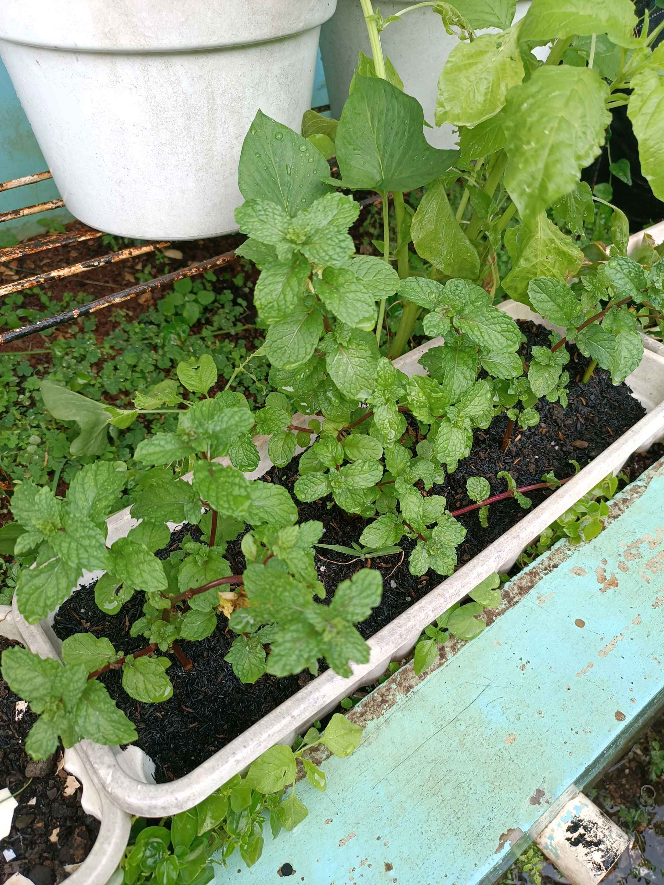
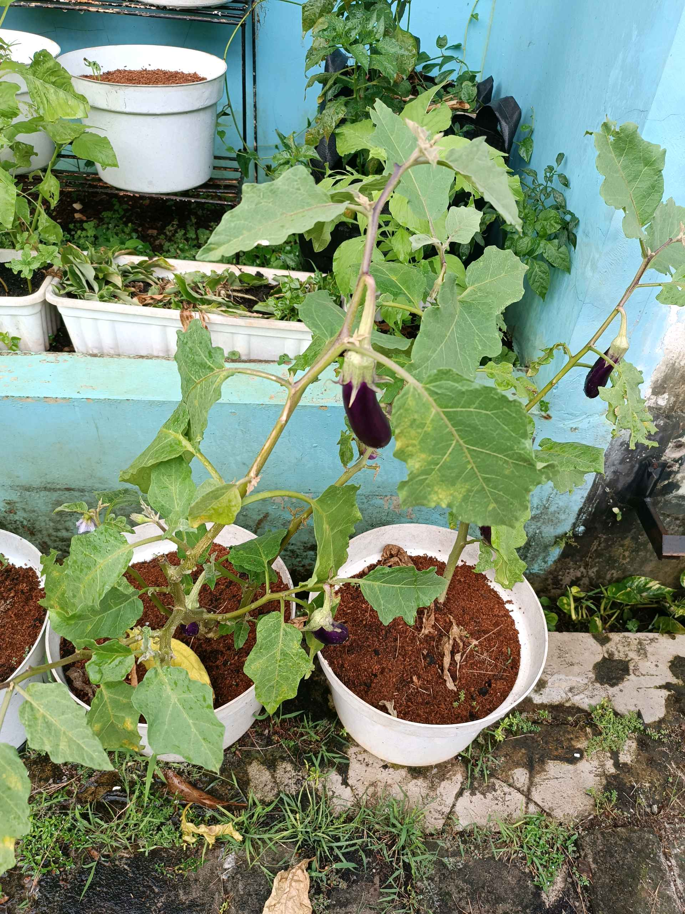
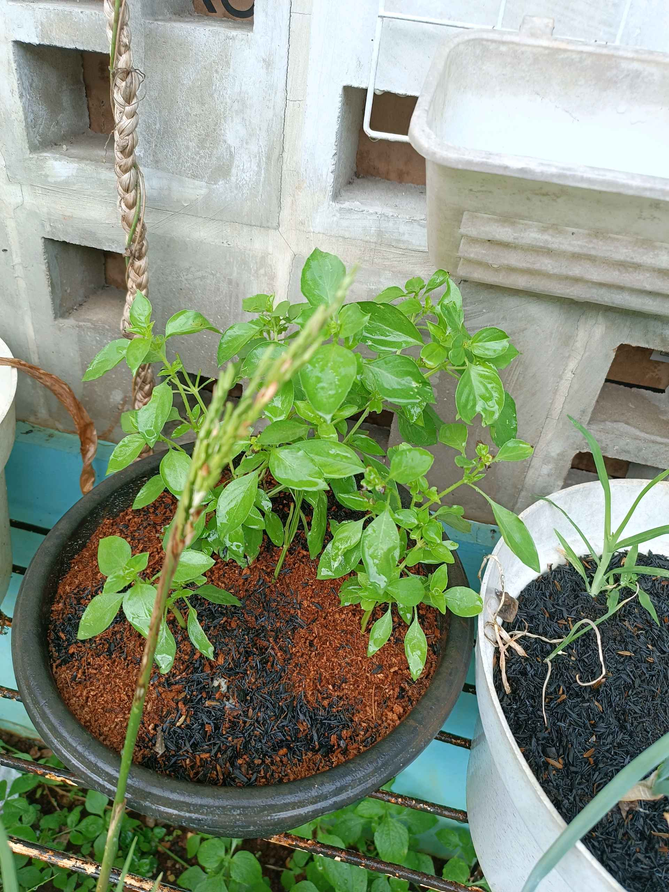

# 15 Desember 2025 - Log Kegiatan Harian

## 📌 Kegiatan
1. Urban Farming
   - Kegiatan: Menyiram tanaman dan membersihkan gulma sebagai bagian dari kegiatan student club urban farming.
   - Alat/bahan: Air dan alat kebun sederhana
   - Durasi: ±60 menit

## 🎯 Capaian Kegiatan
- Terlibat dalam perawatan tanaman dengan menyiram dan membersihkan gulma.
- Mengikuti kegiatan urban farming sesuai jadwal.

## 🚧 Kendala
- Tidak ada kendala yang dicatat.

## 🖼️ Dokumentasi Kegiatan

