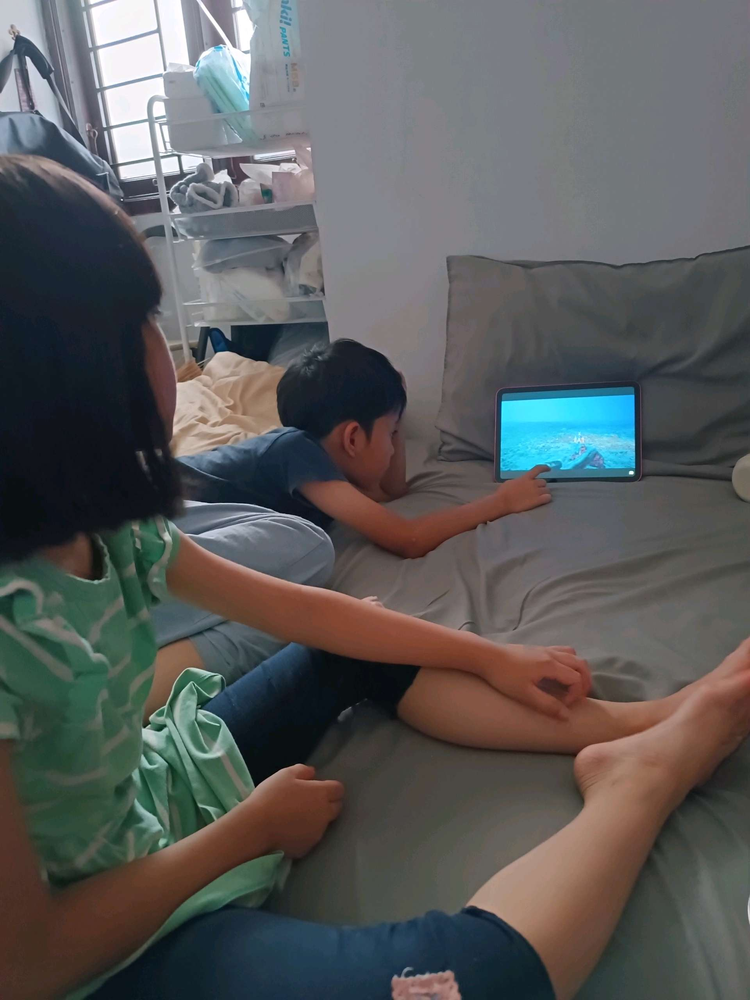

# 14 Januari 2026 - Log Kegiatan Harian
[Kembali](readme.md)

## 📌 Kegiatan
1. Kegiatan Utama:
   - Kegiatan: Setelah selesai morning routine, lanjut persiapan untuk ikut kelas bahasa Indonesia dengan kak Asri.
     Abang yang sudah membaik, mulai semangat lagi ikut kelas.
     Sorenya kami belajar tentang beragam jenis ikan via channel youtube natgeo dan bbc earth.
   - Alat/bahan: -
   - Durasi: -

## 🎯 Capaian Kegiatan
- Belajar kata kerja.
  Mengenal jenis ikan di alam.

## 🚧 Kendala
- Karena hujan masih mengguyur sepanjang hari, maka beberapa hari terakhir blm bisa aktifitas diluar. Disamping itu, umma juga sakit, jd aktifitas lebih banyak di dalam kamar.

## 🖼️ Dokumentasi Kegiatan

[Kembali](readme.md)
