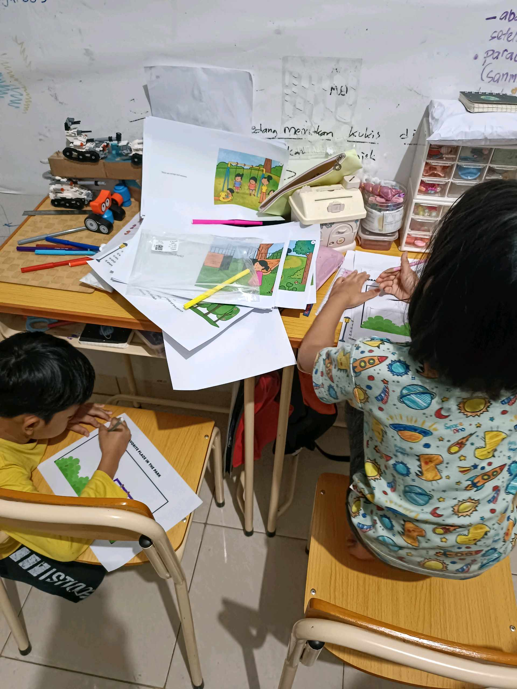
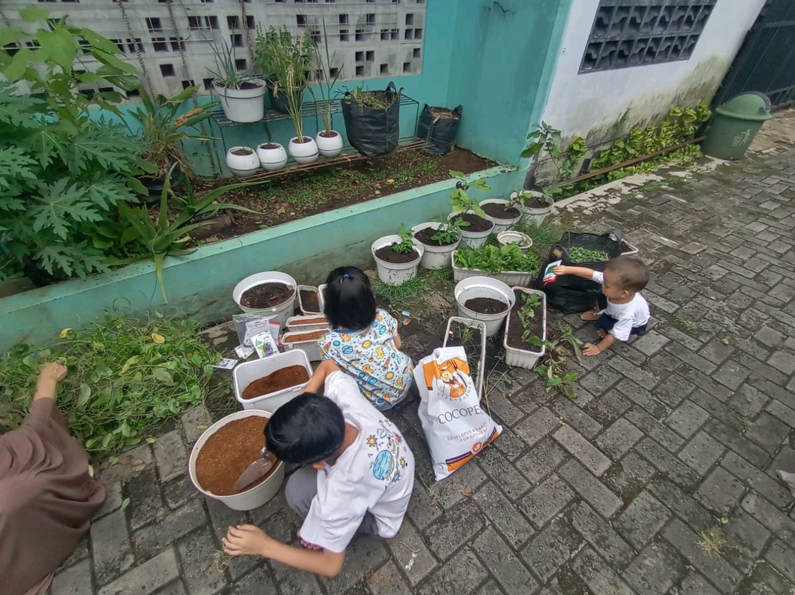

# 16 Januari 2026 - Log Kegiatan Harian
[Kembali](readme.md)

## 📌 Kegiatan
1. Kegiatan Utama:
   - Kegiatan: Pagi, Abang dan kakak bermain dg teman masing². 
     Selesai bermain, kita berkebun untuk merapikan kebun kecil depan rumah, lalu menanam benih baru.
     Malamnya kami mencicil mengerjakan tugas bahasa inggris yang teetunda.
     Belajar tentang cacing
   - Alat/bahan: -
   - Durasi: -

## 🎯 Capaian Kegiatan
- Aktifitas outdoor.
  Grounding, berjemur.

## 🚧 Kendala
- Ditengah berkebun sempat hujan, jd kegiatan berkebun ditunda sementara

## 🖼️ Dokumentasi Kegiatan

[Kembali](readme.md)
