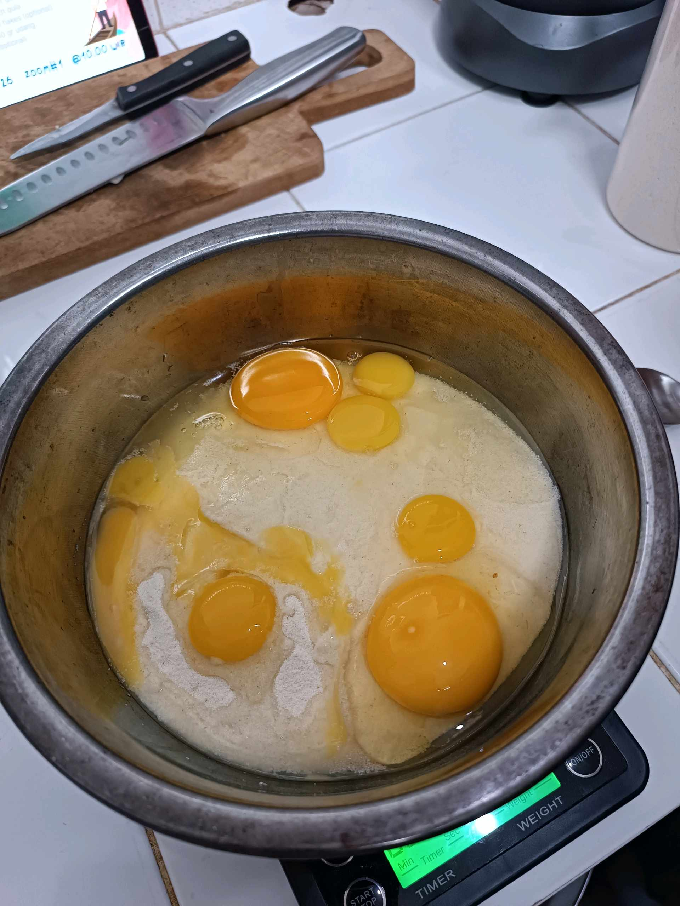
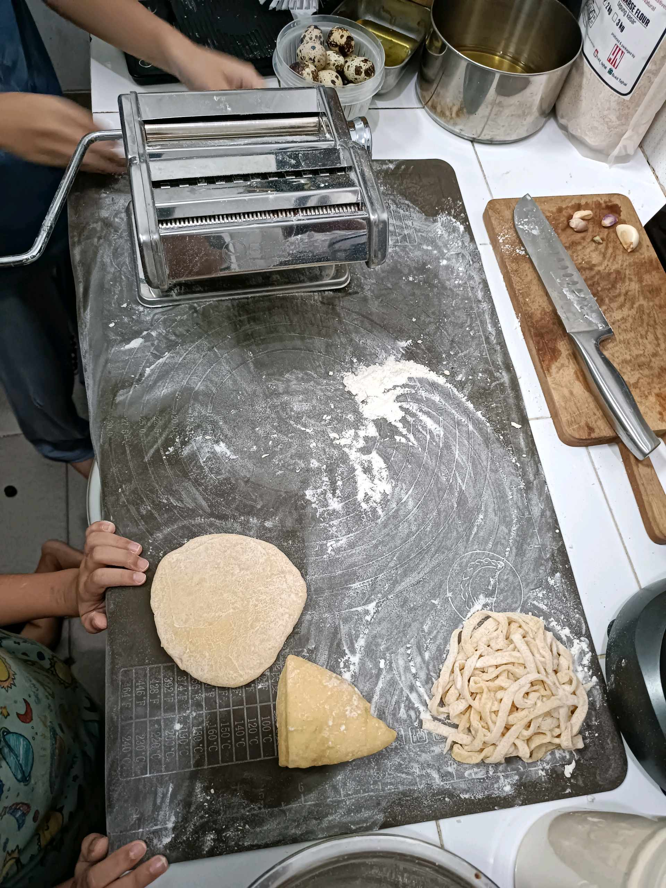
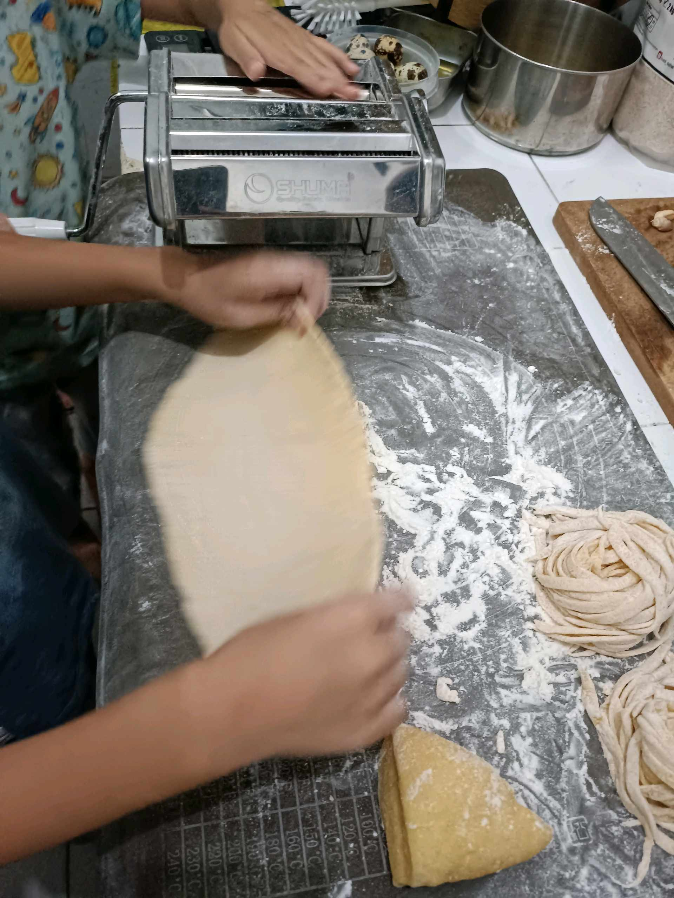
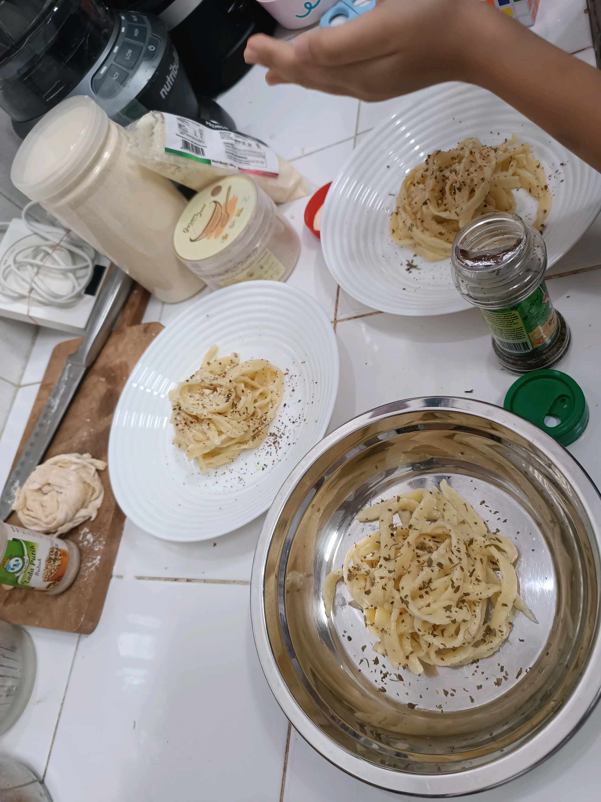

# 23 Januari 2026 - Log Kegiatan Harian
[Kembali](readme.md)

## 📌 Kegiatan
1. Kegiatan Utama:
   - Kegiatan: alhamdulillah kakak dan abang sudah jauh lebih baik. Mereka sudah antusias untuk ikut sc cooking class yang prakteknya adalah membuat pasta homemade. Sorenya alhamdulillah bisa ikut kelas sc melukis juga dengan seru.
   - Alat/bahan: -
   - Durasi: -

## 🎯 Capaian Kegiatan
- membuat pasta homemade dan belajar melukis objek baru lagi

## 🚧 Kendala
- karena kendala teknis jd terlamnat join live facebook saat ikut sc cooking class, tp alhamdulillah bisa mengikuti kembali.

## 🖼️ Dokumentasi Kegiatan

[Kembali](readme.md)
