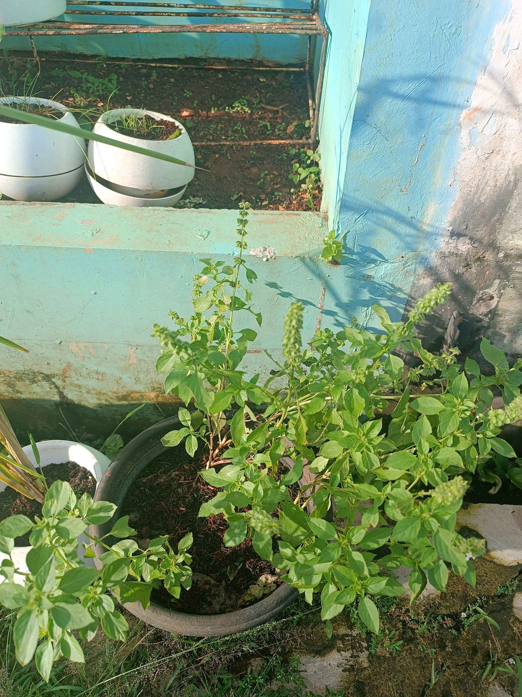
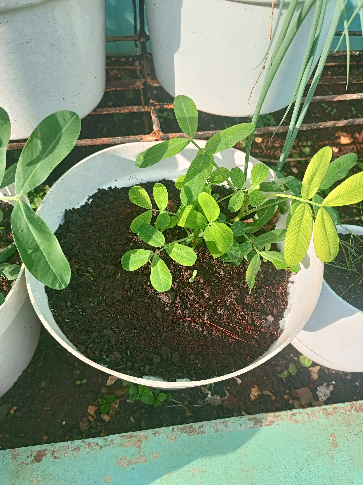
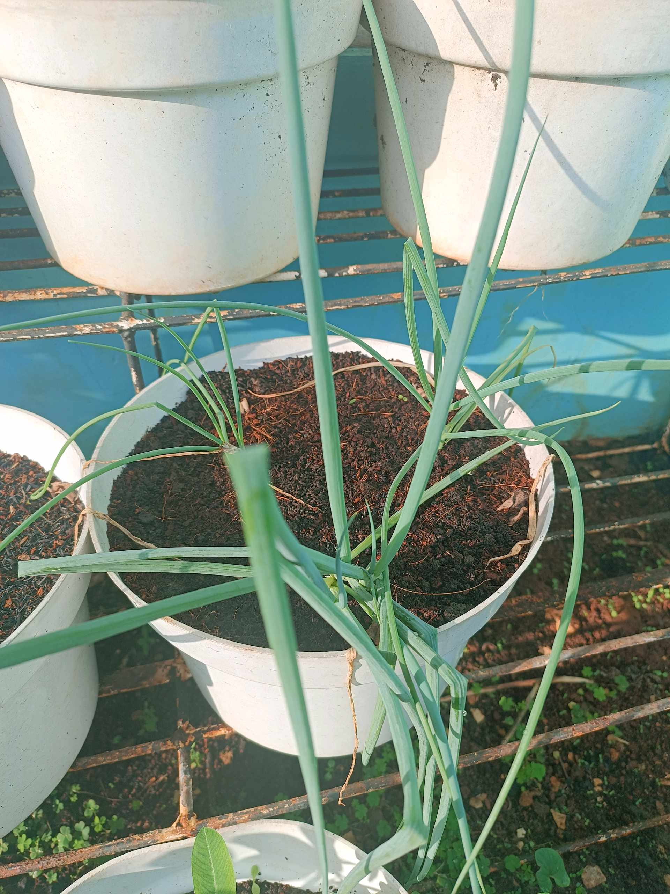
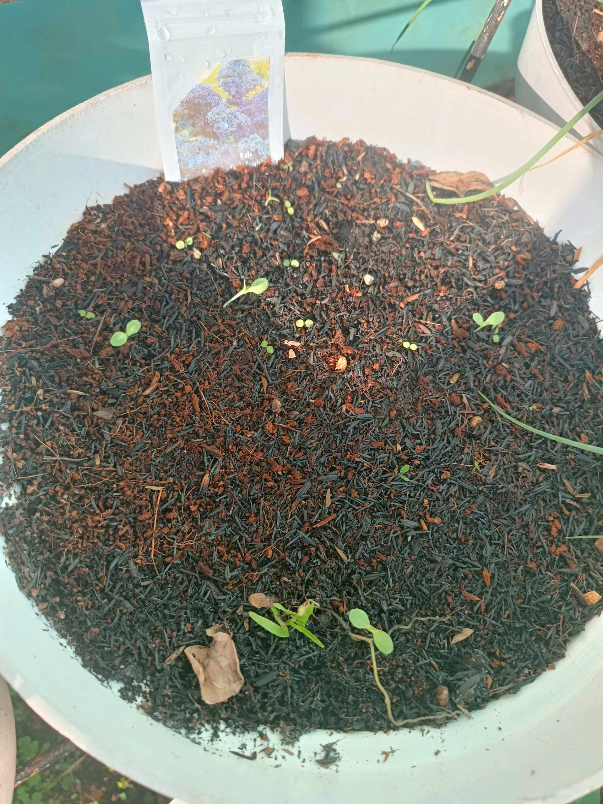
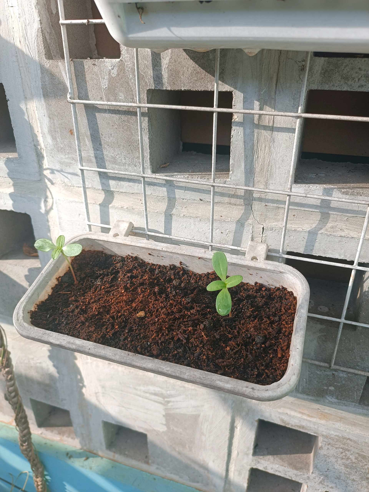

# 24 Januari 2026 - Log Kegiatan Harian
[Kembali](readme.md)

## 📌 Kegiatan
1. Kegiatan Utama:
   - Kegiatan: Sambil berjemur, menyiram dan merawat tanaman. Beberapa benih semaian sudah sprout.
   - Alat/bahan: -
   - Durasi: -

## 🎯 Capaian Kegiatan
- Rawat badan dengan berjemur dan grounding untuk bantu pemulihan.

## 🚧 Kendala
- Hari masih sering hujan sehingga kegiatan luar rumah masih sangat terbatas.

## 🖼️ Dokumentasi Kegiatan

[Kembali](readme.md)
