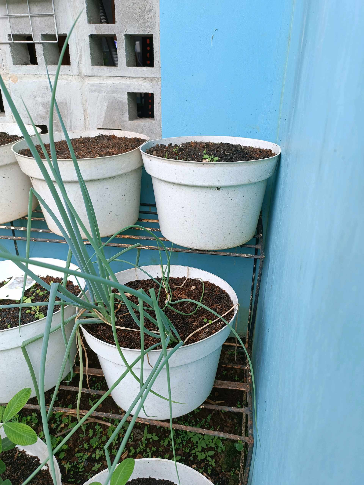

# 2 Februari 2026 - Log Kegiatan Harian
[Kembali](readme.md)

## 📌 Kegiatan
1. Kegiatan Utama:
   - Kegiatan: Urban farming di kebun rumah. Abang merawat dan memantau pertumbuhan tanaman di pot — daun bawang yang sudah memanjang, semaian kacang tanah yang sudah berdaun, mint, dan beberapa benih baru yang mulai sprout. Termasuk juga mengamati daun kunyit yang baru dipanen.
   - Alat/bahan: -
   - Durasi: -

## 🎯 Capaian Kegiatan
- Mengamati siklus pertumbuhan tanaman dari benih sampai sprout.
- Konsistensi merawat kebun keluarga.

## 🚧 Kendala
- -

## 🖼️ Dokumentasi Kegiatan

[Kembali](readme.md)
