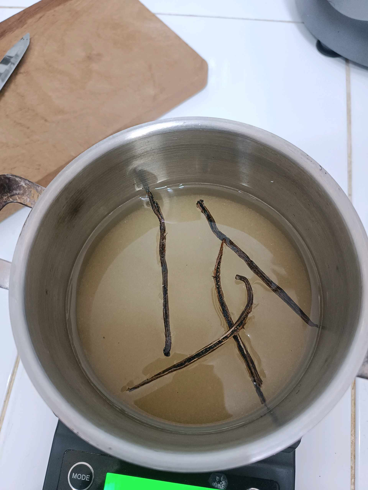

# 3 Februari 2026 - Log Kegiatan Harian
[Kembali](readme.md)

## 📌 Kegiatan
1. Kegiatan Utama:
   - Kegiatan: Eksperimen dapur — Abang ikut belajar membuat ayam goreng aromatik dengan daun jeruk, lalu mengamati proses pembuatan sirup vanila buatan rumah dari biji vanila yang direbus dan disimpan dalam botol kaca untuk perasa kue/minuman.
   - Alat/bahan: -
   - Durasi: -

## 🎯 Capaian Kegiatan
- Mengenal proses ekstraksi rasa dari rempah (vanila bean).
- Memahami pengaruh daun jeruk pada aroma ayam goreng.

## 🚧 Kendala
- -

## 🖼️ Dokumentasi Kegiatan

[Kembali](readme.md)
