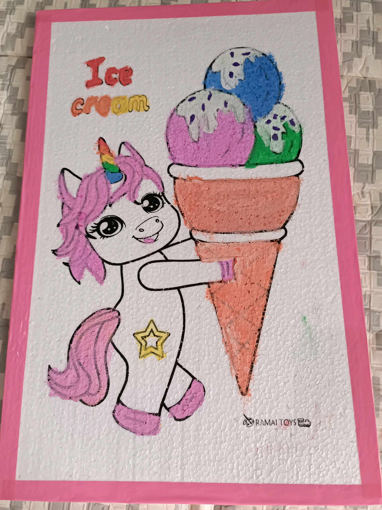
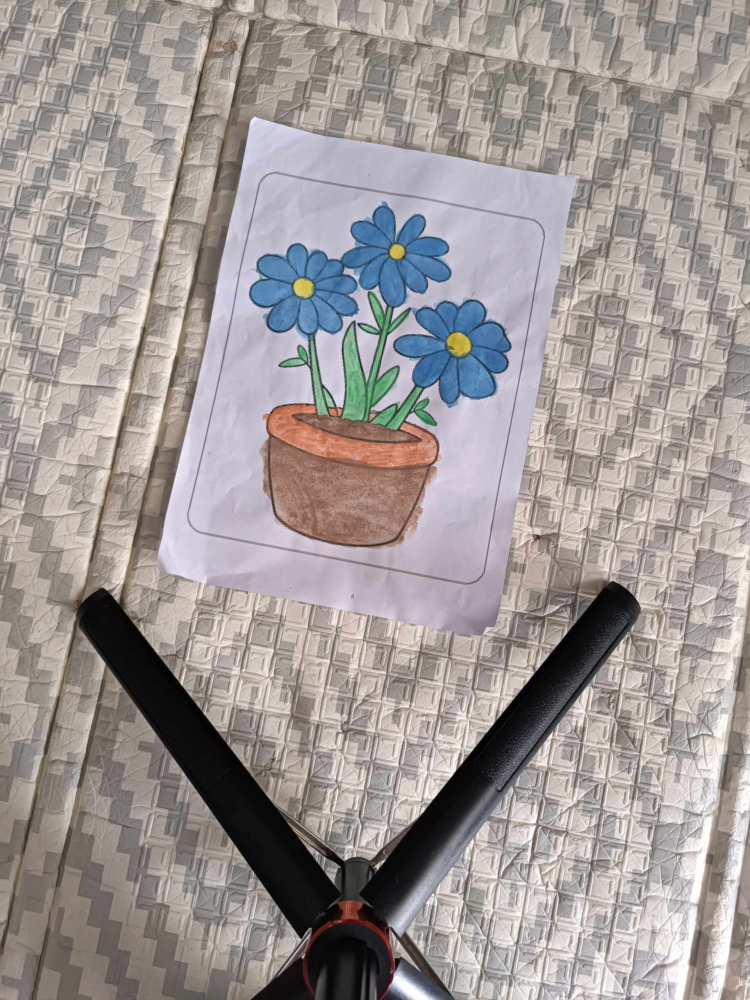

# 7 Februari 2026 - Log Kegiatan Harian
[Kembali](readme.md)

## 📌 Kegiatan
1. Kegiatan Utama:
   - Kegiatan: Aktivitas akhir pekan — Abang ikut keluarga ke jajanan/pasar malam, ikut membantu memilih dan membawa belanjaan. Di rumah, lanjut mewarnai/menyelesaikan karya seni di atas kertas (pot bunga biru).
   - Alat/bahan: -
   - Durasi: -

## 🎯 Capaian Kegiatan
- Pengalaman sosial di lingkungan luar rumah.
- Latihan motorik halus pada karya mewarnai.

## 🚧 Kendala
- -

## 🖼️ Dokumentasi Kegiatan

[Kembali](readme.md)
