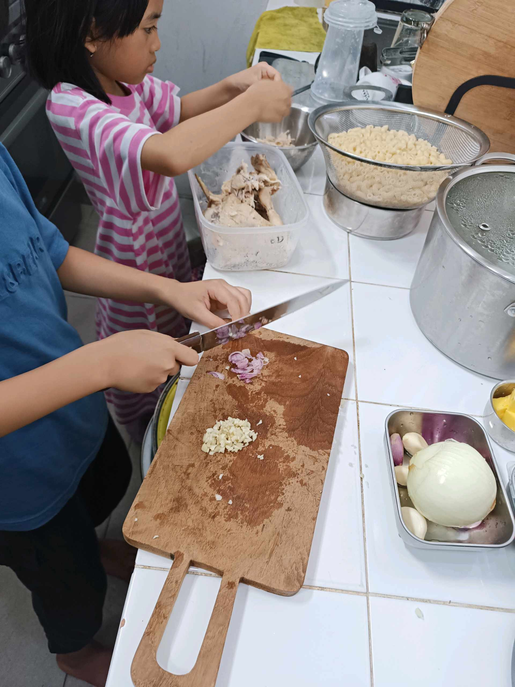
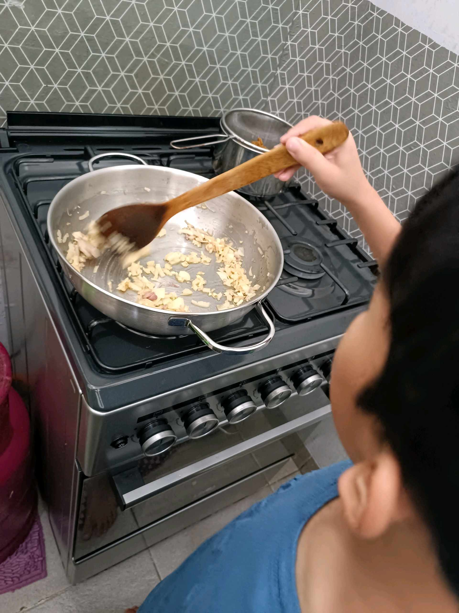
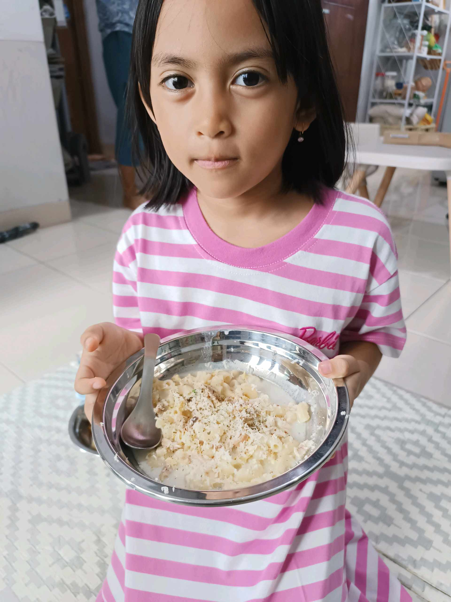

# 8 Februari 2026 - Log Kegiatan Harian
[Kembali](readme.md)

## 📌 Kegiatan
1. Kegiatan Utama:
   - Kegiatan: Memasak di dapur — Abang bertugas memotong bawang putih dan bawang merah di atas talenan kayu, lalu menumis aromatik di wajan untuk membuat hidangan berbasis macaroni dengan suwiran ayam.
   - Alat/bahan: pisau, talenan, wajan, bawang putih, bawang merah, macaroni, ayam
   - Durasi: -

## 🎯 Capaian Kegiatan
- Latihan memotong dengan pisau secara aman dan koordinasi tangan–mata.
- Belajar teknik dasar menumis aromatik di kompor.

## 🚧 Kendala
- -

## 🖼️ Dokumentasi Kegiatan

[Kembali](readme.md)
