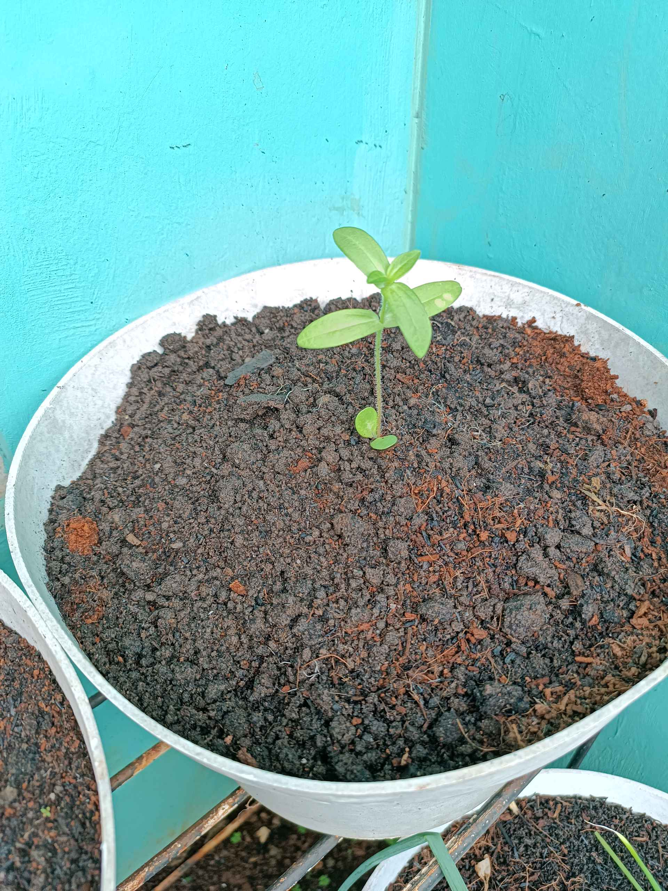
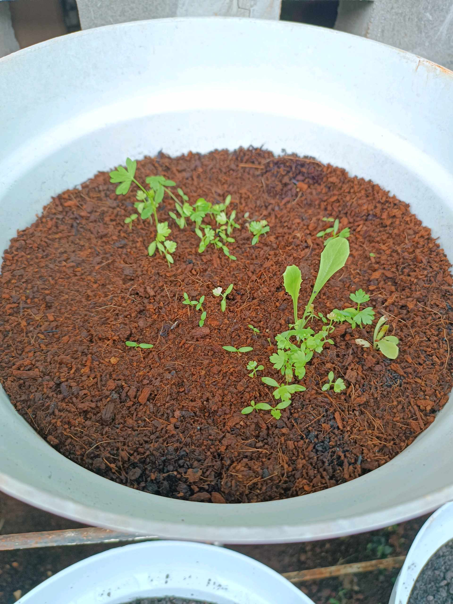
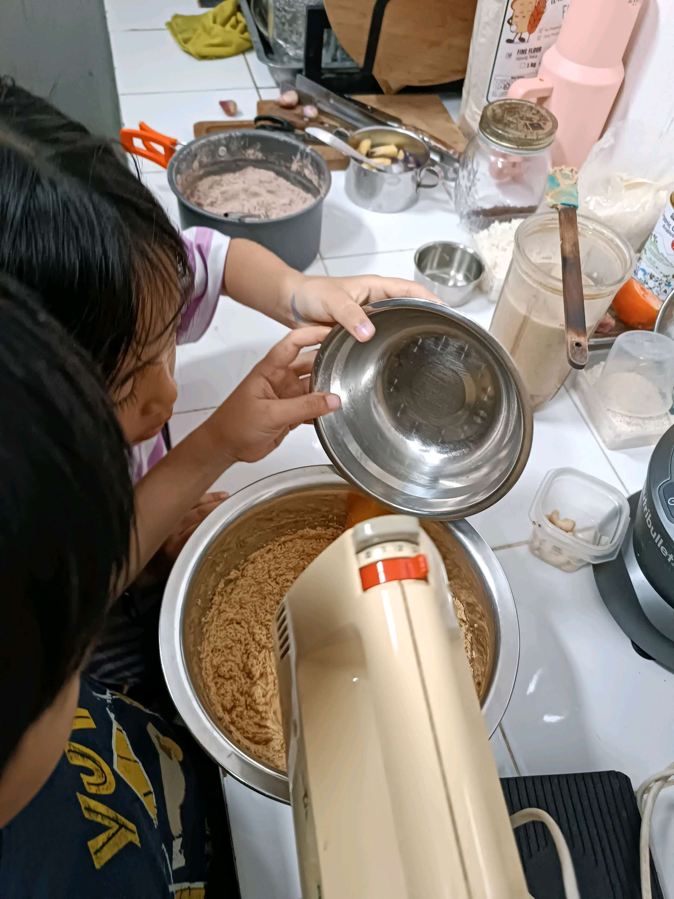
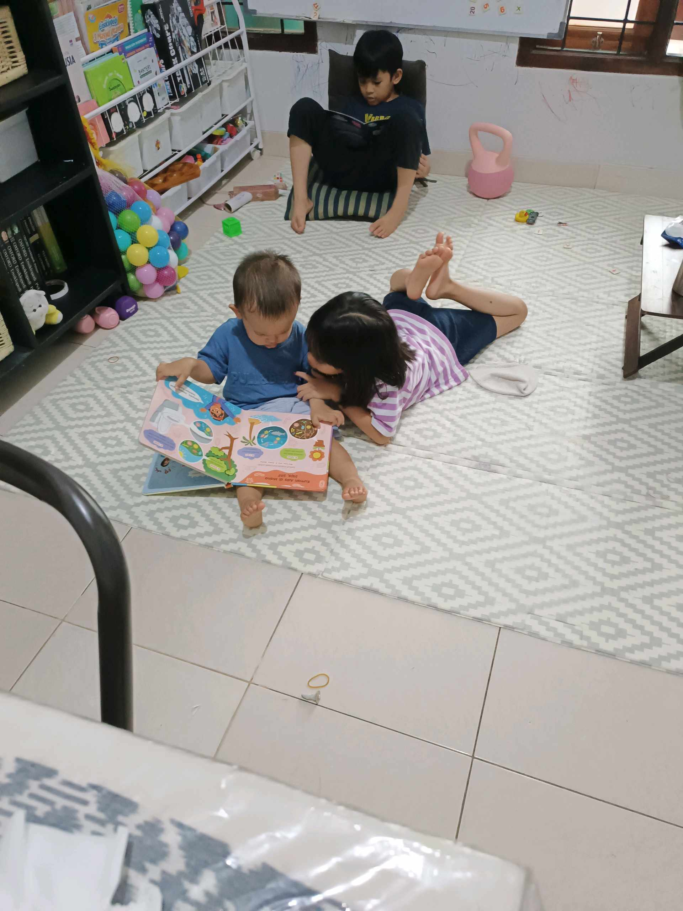

# 9 Februari 2026 - Log Kegiatan Harian
[Kembali](readme.md)

## 📌 Kegiatan
1. Kegiatan Utama:
   - Kegiatan: Pagi: cek urban farming — semaian tomat dan seledri/parsley sudah sprout dengan baik. Sore: ikut proses baking di dapur, mengoperasikan hand mixer untuk mengocok adonan kue coklat. Malam: quality time keluarga di ruang bermain (membaca dan bermain bersama).
   - Alat/bahan: hand mixer, mangkuk adonan, tepung, kakao bubuk
   - Durasi: -

## 🎯 Capaian Kegiatan
- Mengamati perkembangan bibit dari benih → sprout.
- Belajar mengoperasikan hand mixer dengan aman saat baking.

## 🚧 Kendala
- -

## 🖼️ Dokumentasi Kegiatan

[Kembali](readme.md)
