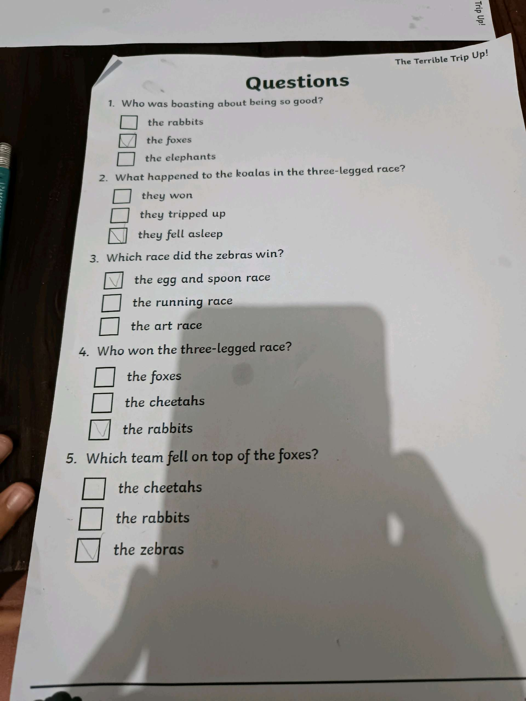
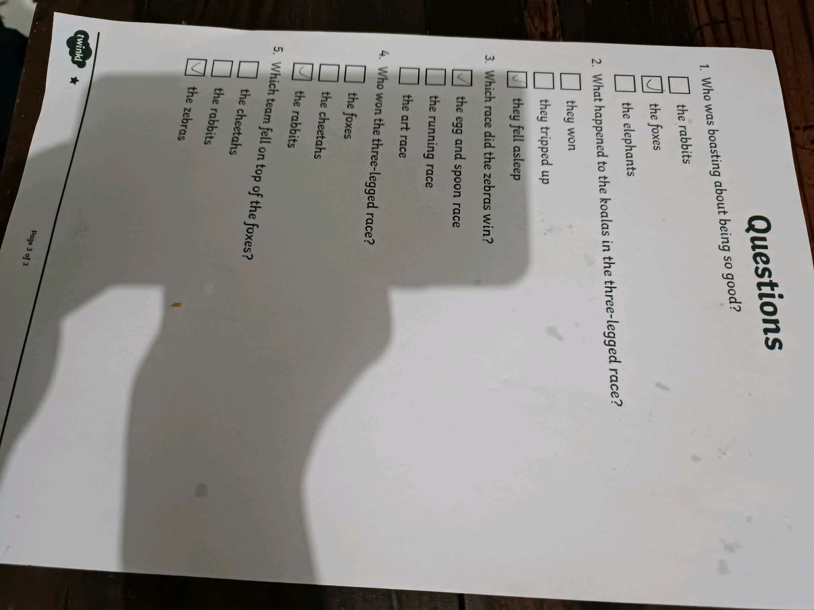

# 10 Februari 2026 - Log Kegiatan Harian
[Kembali](readme.md)

## 📌 Kegiatan
1. Kegiatan Utama:
   - Kegiatan: SC Bahasa Inggris — Abang mengerjakan worksheet reading comprehension cerita "The Terrible Trip Up!" (tentang lomba balapan antar hewan: rabbits, foxes, koalas, zebras, cheetahs). Lima pertanyaan pilihan ganda dijawab semua dengan benar. Sebelumnya juga sempat membaca buku cerita anak bersama Aasiyah.
   - Alat/bahan: worksheet Twinkl, pulpen
   - Durasi: -

## 🎯 Capaian Kegiatan
- Memahami cerita Bahasa Inggris dan menjawab pertanyaan komprehensi dengan tepat.
- Kebiasaan literasi: membaca buku cerita bersama saudara.

## 🚧 Kendala
- -

## 🖼️ Dokumentasi Kegiatan

[Kembali](readme.md)
