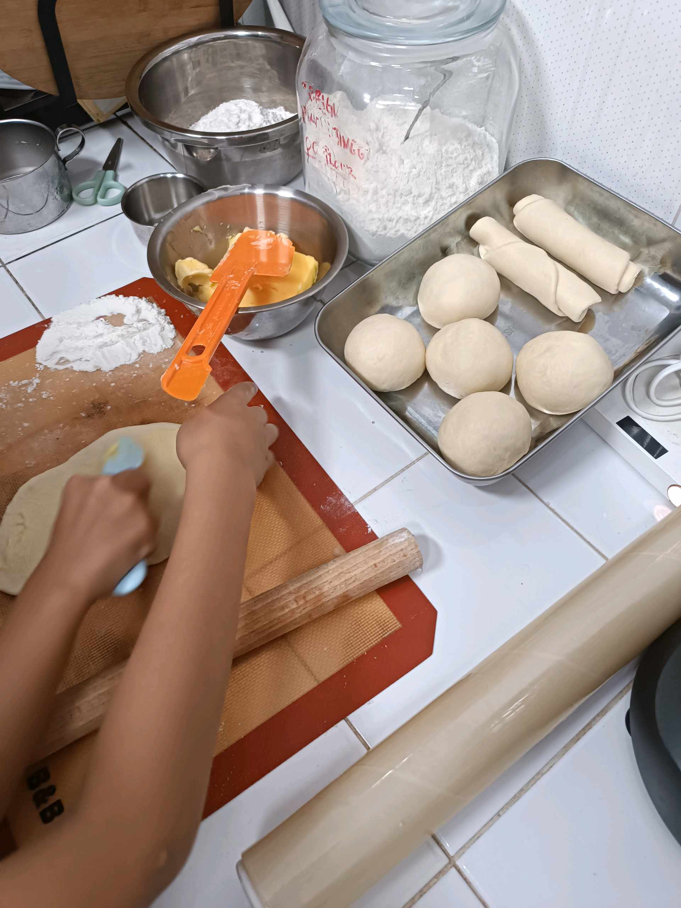
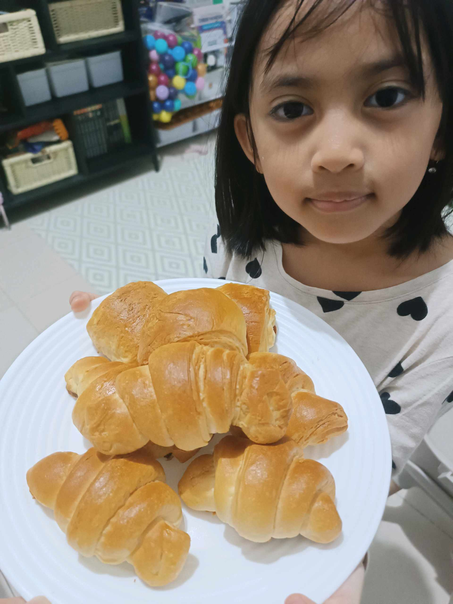
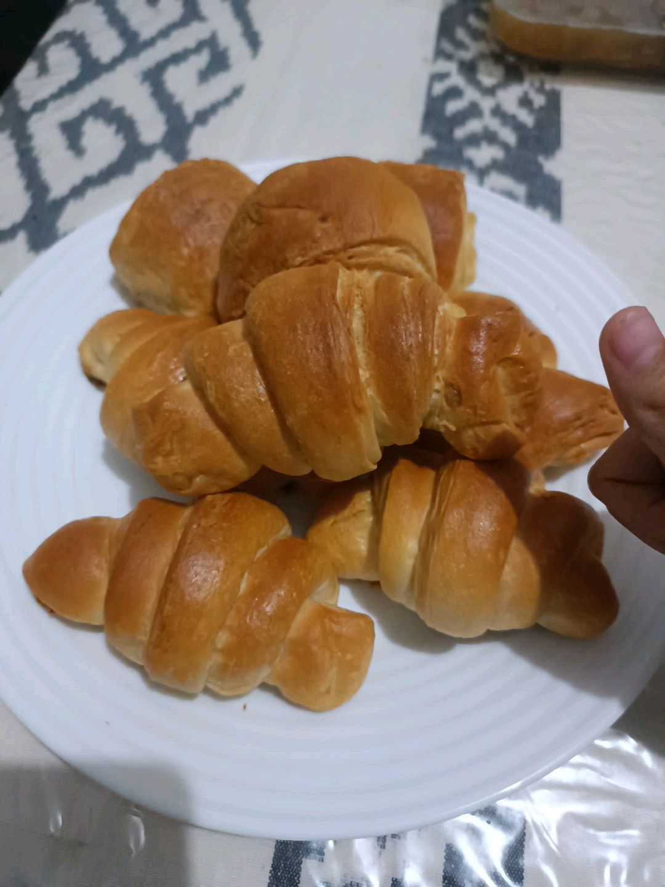

# 13 Februari 2026 - Log Kegiatan Harian
[Kembali](readme.md)

## 📌 Kegiatan
1. Kegiatan Utama:
   - Kegiatan: SC Cooking — membuat croissant homemade. Tahapan: menyiapkan bahan (tepung, mentega, gula, ragi), menguleni adonan, membagi adonan menjadi bola-bola kecil, melapisi dengan mentega, menggulung dan membentuk bulan sabit, lalu di-bake hingga golden brown.
   - Alat/bahan: tepung terigu, mentega, gula, ragi, dough scraper, rolling pin, Silpat baking mat, oven
   - Durasi: -

## 🎯 Capaian Kegiatan
- Membuat croissant dari nol dengan hasil matang merata dan warna golden brown.
- Memahami konsep laminasi adonan (lipatan mentega) pada pastry.

## 🚧 Kendala
- -

## 🖼️ Dokumentasi Kegiatan

[Kembali](readme.md)
