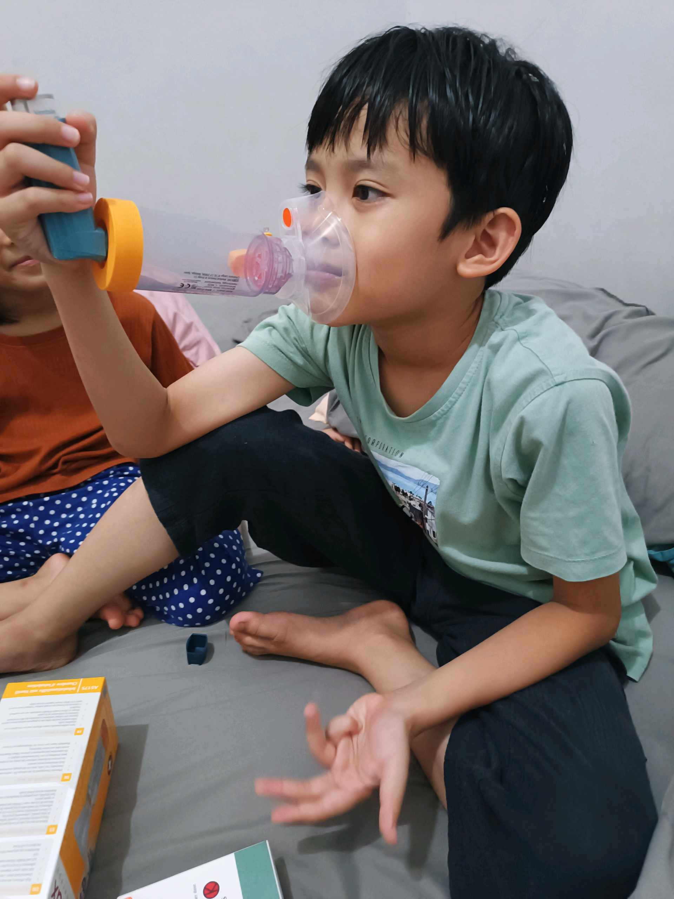

# 15 Februari 2026 - Log Kegiatan Harian
[Kembali](readme.md)

## 📌 Kegiatan
1. Kegiatan Utama:
   - Kegiatan: Mengamati akuarium ikan air tawar — tanaman air, kerikil, dan ikan kecil (mungkin endler/guppy). Sambil rawat badan, Abang menggunakan inhaler dengan spacer chamber untuk menjaga saluran napas tetap stabil.
   - Alat/bahan: akuarium, inhaler + spacer
   - Durasi: -

## 🎯 Capaian Kegiatan
- Observasi ekosistem mini di akuarium.
- Disiplin pribadi: rawat badan dengan inhaler secara mandiri.

## 🚧 Kendala
- Saluran napas masih perlu perawatan rutin pasca-episode sesak napas (lanjutan dari Januari).

## 🖼️ Dokumentasi Kegiatan

[Kembali](readme.md)
