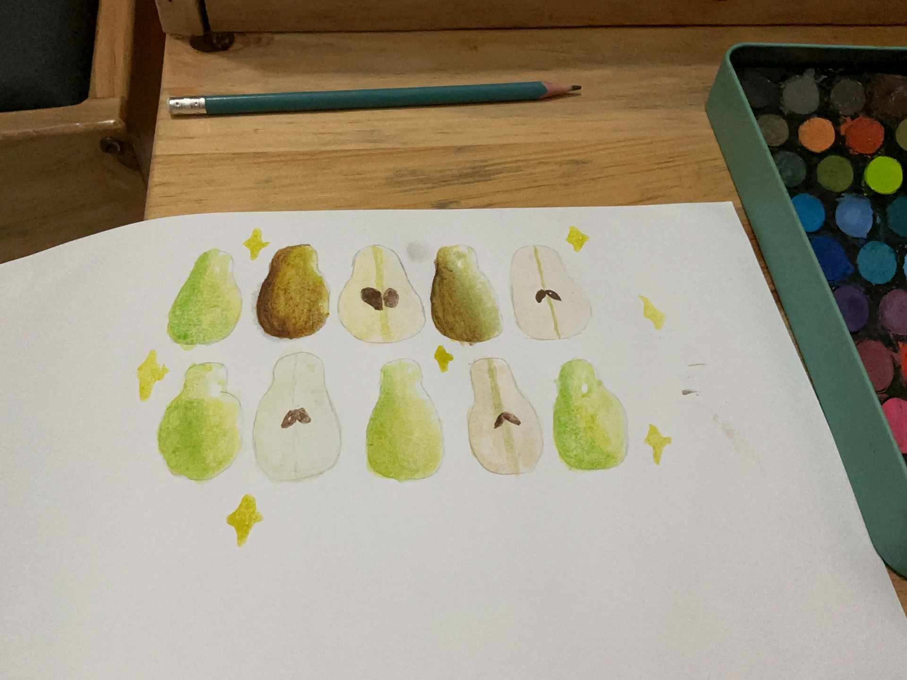

# 19 Februari 2026 - Log Kegiatan Harian
[Kembali](readme.md)

## 📌 Kegiatan
1. Kegiatan Utama:
   - Kegiatan: Baking di dapur — Abang membantu mengayak tepung dengan sifter ke dalam mangkuk besar bersama Aasiyah, persiapan adonan untuk kue.
2. Kegiatan Tambahan:
   - Kegiatan: SC Seni Lukis — melukis cat air dengan tema buah pir (pears). Abang melukis 10 pir dalam berbagai posisi: ada yang utuh dengan kulit hijau/coklat, ada yang dibelah memperlihatkan biji di dalamnya. Latihan gradasi warna dan tekstur kulit buah.
   - Alat/bahan: cat air, kuas, kertas lukis, palet warna
   - Durasi: -

## 🎯 Capaian Kegiatan
- Belajar teknik mengayak tepung sebagai bagian dari proses baking.
- Karya lukisan cat air bertema pir selesai dengan gradasi warna yang halus dan detail biji yang tepat.

## 🚧 Kendala
- -

## 🖼️ Dokumentasi Kegiatan

[Kembali](readme.md)
