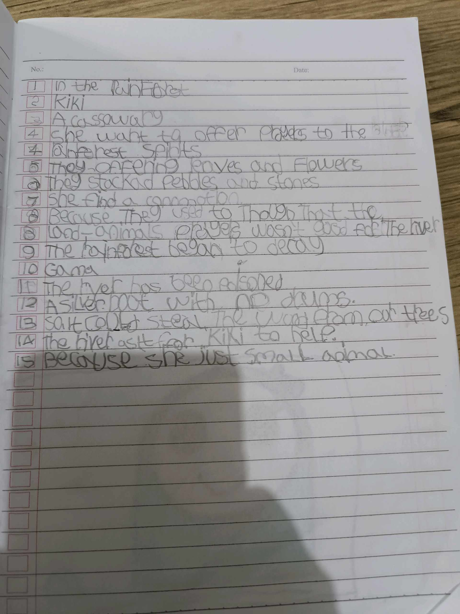
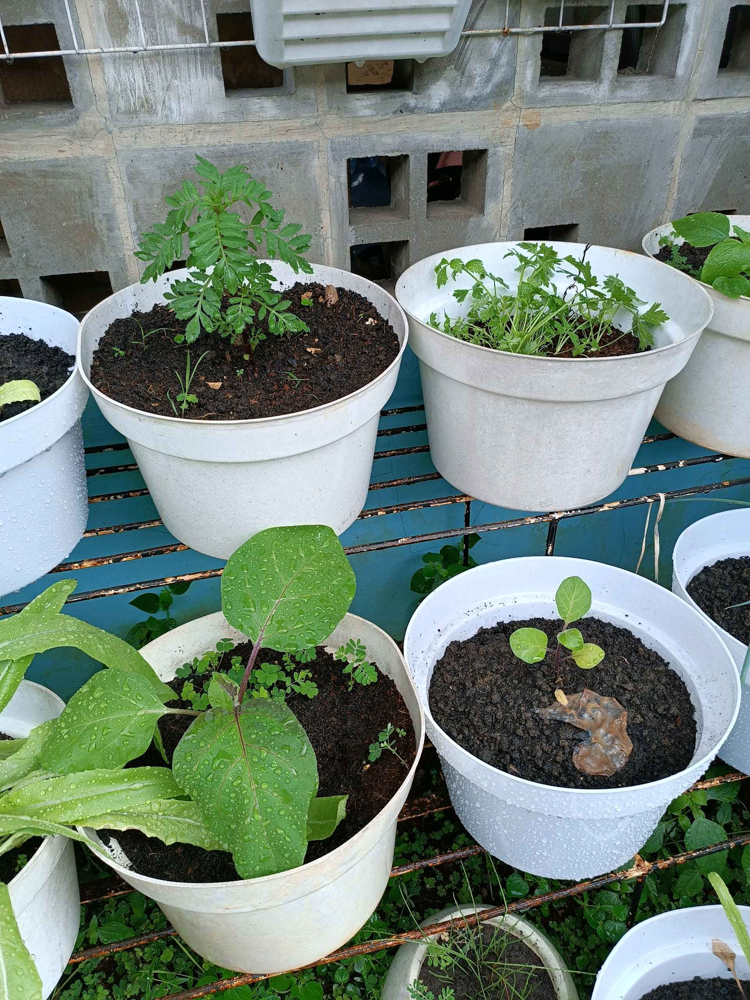

# 1 Maret 2026 - Log Kegiatan Harian
[Kembali](readme.md)

## 📌 Kegiatan
1. Kegiatan Utama:
   - Kegiatan: Menyajikan basque cheesecake yang dipanggang kemarin — Abang memotong dan menata slice cheesecake di piring dengan saus blueberry dan daun mint sebagai garnish, lalu disajikan bersama saudara.
   - Alat/bahan: basque cheesecake, blueberry beku, daun mint, pisau, piring
   - Durasi: -
2. Kegiatan Tambahan:
   - Kegiatan: SC Bahasa Inggris — Abang membaca cerita "In the rainforest" tentang Kiki si cassowary dan menulis 15 jawaban pertanyaan komprehensi di buku tulis (mis. "She want to offer prayers to the rainforest spirits", "The river has been poisoned", dll).
   - Alat/bahan: buku tulis, pensil, materi bacaan
   - Durasi: -
3. Kegiatan Tambahan:
   - Kegiatan: Cek urban farming sore hari — tanaman kelor (moringa) tumbuh subur, seledri dan terong berkembang baik. Sempat menyiram tanaman.
   - Alat/bahan: -
   - Durasi: -

## 🎯 Capaian Kegiatan
- Plating dan menyajikan basque cheesecake dengan presentasi rapi.
- Menyelesaikan 15 pertanyaan komprehensi Bahasa Inggris dengan jawaban lengkap dalam kalimat.
- Konsistensi merawat kebun.

## 🚧 Kendala
- -

## 🖼️ Dokumentasi Kegiatan

[Kembali](readme.md)
