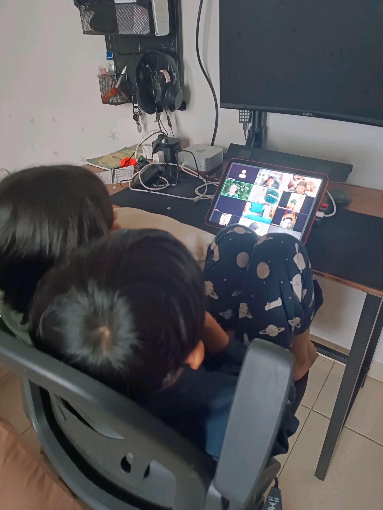
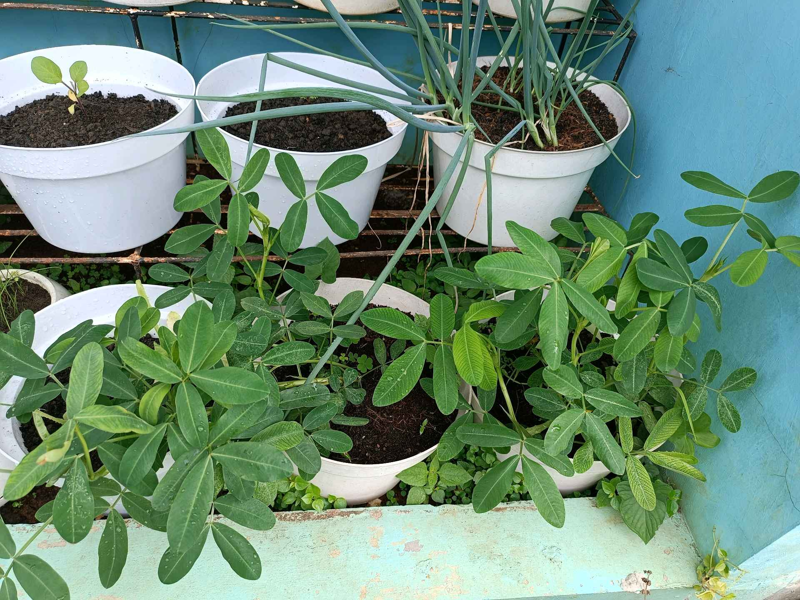
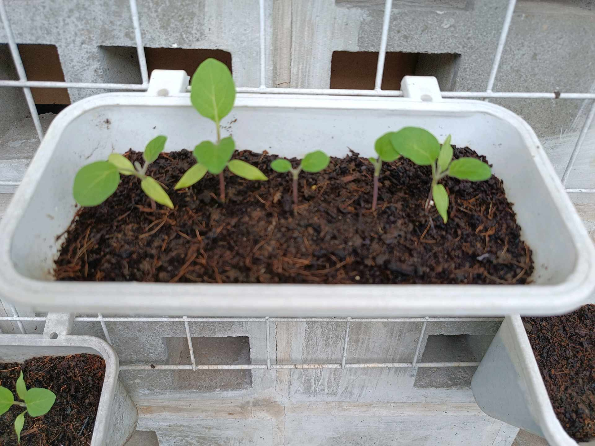

# 23 Februari 2026 - Log Kegiatan Harian
[Kembali](readme.md)

## 📌 Kegiatan
1. Kegiatan Utama:
   - Kegiatan: SC online via iPad bersama teman-teman di tile video (kelas live). Sore: cek urban farming — tanaman kacang tanah daunnya rimbun, daun bawang tetap subur, dan semaian terong (eggplant) sudah sprout dengan 4-5 daun.
   - Alat/bahan: iPad untuk kelas online
   - Durasi: -

## 🎯 Capaian Kegiatan
- Konsisten mengikuti kelas SC online dengan fokus.
- Memantau perkembangan semaian terong yang sudah mulai tumbuh.

## 🚧 Kendala
- -

## 🖼️ Dokumentasi Kegiatan

[Kembali](readme.md)
