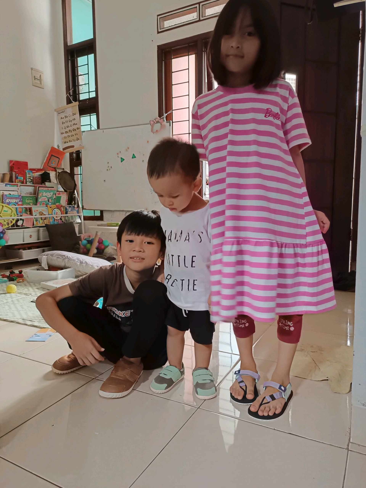
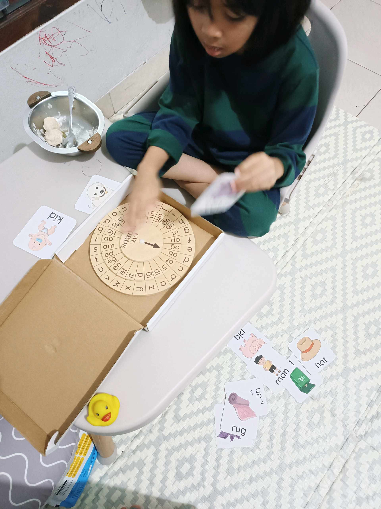

# 24 Februari 2026 - Log Kegiatan Harian
[Kembali](readme.md)

## 📌 Kegiatan
1. Kegiatan Utama:
   - Kegiatan: Quality time bersama saudara — Abang menemani Aasiyah berlatih membaca dengan phonics wheel (alat CVC word builder) dan flashcard kata sederhana (kid, bid, men, rug, hat), sambil menjaga adik bermain.
   - Alat/bahan: phonics wheel, flashcard CVC
   - Durasi: -

## 🎯 Capaian Kegiatan
- Berperan sebagai kakak yang membantu adiknya berlatih membaca.
- Konsistensi family bonding.

## 🚧 Kendala
- -

## 🖼️ Dokumentasi Kegiatan

[Kembali](readme.md)
