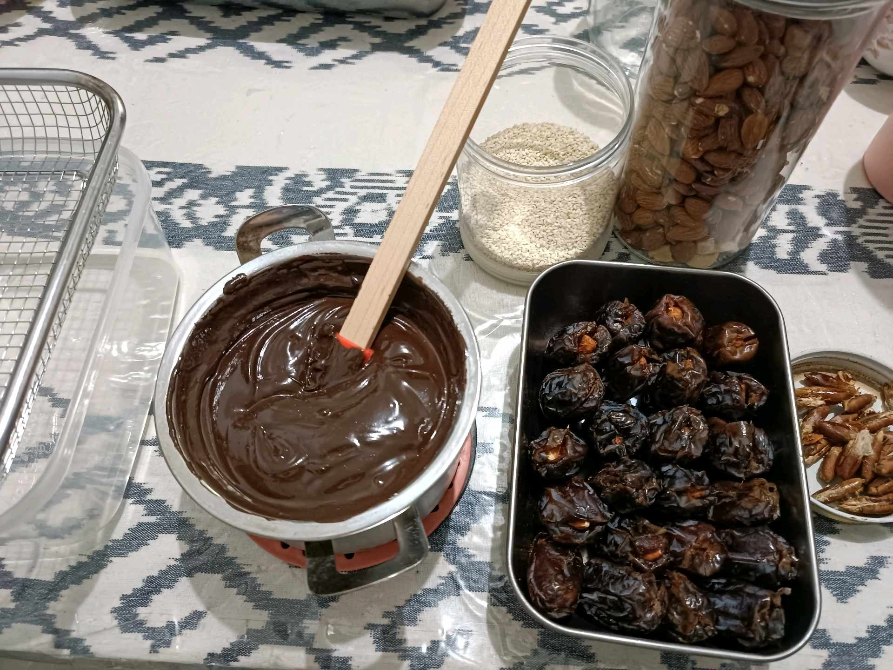

# 26 Februari 2026 - Log Kegiatan Harian
[Kembali](readme.md)

## 📌 Kegiatan
1. Kegiatan Utama:
   - Kegiatan: Membuat coklat kurma isi almond — Abang ikut proses melelehkan dark chocolate dan mengisi kurma dengan kacang almond utuh, lalu mencelupkan kurma yang sudah diisi ke coklat leleh dan ditaburi wijen sebagai topping.
   - Alat/bahan: kurma, almond, dark chocolate, wijen, panci kecil, spatula
   - Durasi: -

## 🎯 Capaian Kegiatan
- Belajar teknik melt chocolate dan tempering sederhana.
- Membuat camilan sehat (snack tinggi serat & protein) di rumah.

## 🚧 Kendala
- -

## 🖼️ Dokumentasi Kegiatan

[Kembali](readme.md)
