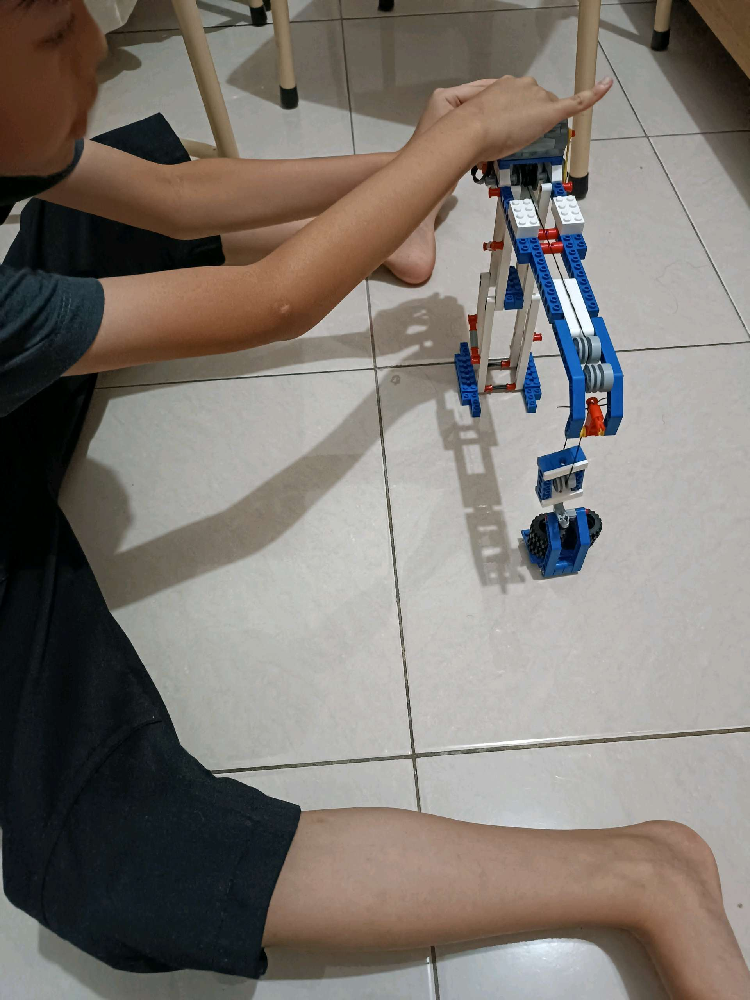

# 2 Maret 2026 - Log Kegiatan Harian
[Kembali](readme.md)

## 📌 Kegiatan
1. Kegiatan Utama:
   - Kegiatan: Project konstruksi LEGO — Abang membangun ulang/iterasi LEGO crane (derek) dengan sistem katrol majemuk: tiang penopang, lengan panjang, beban (roda) yang menggantung melalui sistem tali dan katrol. Latihan mekanika sederhana — bagaimana katrol mengangkat beban dan bagaimana lengan crane seimbang.
   - Alat/bahan: set LEGO Technic, beban (roda LEGO)
   - Durasi: -

## 🎯 Capaian Kegiatan
- Menyelesaikan konstruksi crane LEGO dengan mekanisme katrol yang bekerja.
- Memahami prinsip dasar katrol dan keseimbangan beban.

## 🚧 Kendala
- -

## 🖼️ Dokumentasi Kegiatan

[Kembali](readme.md)
